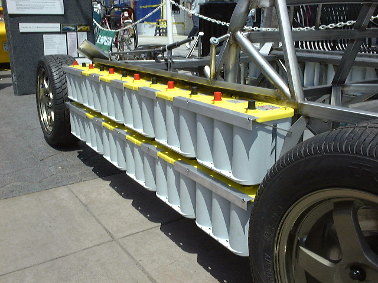

Baset trailers and removable batteries follows the principle of
**replacing instead of recharging**.

A **baset trailer** is a range extending device for use with [battery
electric vehicles](battery_electric_vehicle "wikilink") consisting of a
[battery pack](battery_pack "wikilink") mounted in a
[trailer](trailer "wikilink"). The batteries (i.e.["D34M" Optima
Blue-Top and Yellow-Top
batteries](http://enviromotors.com/wiki/index.php/Sparrow/Batteries))
can be [replaced](wikt:replace "wikilink") by recharged ones. Most small
to midsized passenger vehicles would require 15 to 20
[kW](wikipedia:kW "wikilink"). Larger vehicles could require 30 kW or
more of power depending on how heavy and/or un-aerodynamic they happen
to be.

They can be also used with [electric buses](electric_bus "wikilink"):
bus companies can store recharged batteries in route strategic points
([bus stations](wikipedia:bus_station "wikilink"), [filling
stations](wikipedia:filling_station "wikilink"), [parking
lots](wikipedia:parking_lot "wikilink"), [electric
utility](wikipedia:electric_utility "wikilink") facilities, ad-hoc
facilities or shops and so on).

In [renting](wikipedia:renting "wikilink"), the maintenance costs of
baset trailers can be deferred to the lessor or agency. They are can
also be given for rent.

Removable individual batteries and trays
----------------------------------------

Batteries can be mounted in a light, easy and accesible [removable
trays](removable_tray "wikilink") or individually, so one can replace
only some batteries when discharged, instead of a trailer.

See also
--------

-   [Epusher trailer](/wiki/Epusher_trailer "wikilink")
-   [Genset trailer](/wiki/Genset_trailer "wikilink")
-   [Green tuning](/wiki/Green_tuning "wikilink")
-   [Pusher trailer](/wiki/Pusher_trailer "wikilink")
-   [Plug-in hybrid](/wiki/Plug-in_hybrid "wikilink")
-   [Trailer](/wiki/Trailer "wikilink")

External links
--------------

-   [Custom trailers](http://apple-trailers.com/custom.htm).
-   [Battery range extender
    module](http://en.wikipedia.org/wiki/Battery_range_extender_module).
-   [Battery handling, including automatic transfer
    carriage](http://www.bhs1.com).
-   [Battery
    handler](http://www.lislecorp.com/tool_detail.cfm?detail=1024) and
    [carrier](http://www.lislecorp.com/tool_detail.cfm?detail=1056) from
    [Lisle Corporation](/wiki/Lisle_Corporation "wikilink").
