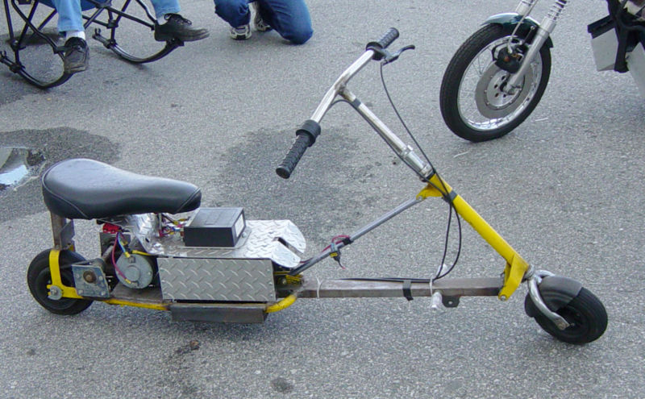

An **electric vehicle conversion** is the modification of a conventional
[internal combustion engine](internal_combustion_engine "wikilink")
(ICE) driven vehicle to [battery](battery_(electricity) "wikilink")
[electric](electricity "wikilink") propulsion, creating a [battery
electric vehicle](battery_electric_vehicle "wikilink"). In some cases
the vehicle may be built by the converter, or assembled from a [kit
car](kit_car "wikilink"), and vehicles of this type are also noted
below.  
Vehicles may be converted by a manufacturer (as was done by [Ford Motor
Company](/wiki/Ford_Motor_Company "wikilink") to create the [Ford Ranger
EV](/wiki/Ford_Ranger_EV "wikilink")) or by an independent converter that
purchases new vehicles without a motor or related equipment (these
vehicles are called "[gliders](/wiki/Glider_(disambiguation) "wikilink")" [1]
and the procedure is called [third-party](third-party "wikilink")
[(power)trainization](powertrain "wikilink")). Most conversions in North
America are performed by hobbyists who typically will convert a well
used vehicle with a non-functioning engine, since such defective
vehicles can be quite inexpensive to purchase. Other hobbyists with
larger budgets may prefer to convert a later model vehicle, or a vehicle
of a particular type.

In some countries, the user can choose to buy a converted vehicle of any
model in the [automaker dealerships](/wiki/Car_dealership "wikilink") only
paying the cost of the batteries and motor, with no installation costs
(it is called preconversion or previous conversion).

Elements of a conversion
------------------------

-   The battery pack, which provides a source of electrical power.
-   The charger which restores energy to the batteries (which may be
    mounted within the vehicle or at a special charging station at some
    fixed location)
-   The power controller, which regulates the flow of energy between the
    battery and the motor(s)
-   One or more electric motors and their mechanical attachment to the
    driveline
-   Power conductors connecting the battery, controller, and motor(s)
-   Accessory equipment to power auxiliary equipment such as power
    brakes and heating system
-   Control circuitry and equipment to allow control and interlocking of
    the various components
-   Instrumentation specific to the operation and maintenance of the
    conversion

Vehicle types (including scratch built)
---------------------------------------

### Electric bicycle

An electric bicycle is a class of bicycles that are fitted with an
electric motor. Often they are powered by rechargeable batteries however
some experimental electric bicycles run directly on or recharge their
batteries via solar panels, fuel cells, gas generators or other
alternative energy sources. Some experimenters have even used super
capacitors to store energy. Using an on-board generator may impact the
legal jurisdictional definition of an electric bicycle. A few types of
electric bicycles are able to re-capture energy from braking and can
re-charge the batteries while braking or travelling down hills
(regenerative braking). With the advent of newer technology further
features can be expected.

Some electric bikes have features where the motor can move the bicycle
by itself if the rider chooses not to pedal, while others require the
rider to pedal at all times. This latter type may in some jurisdictions
allow the vehicle to be used on bicycle trails that otherwise prohibit
motorized vehicles of any kind. (See [motorized
bicycle](motorized_bicycle "wikilink")).

The conversion of a bicycle to electric power is probably the lowest
cost means of learning conversion methods. Battery packs are usually
lead acid gel cells since these are available in small sizes suitable
for this application. It is also practical to experiment with more
expensive battery types since only a small pack is required. It is
possible to repurpose battery packs and chargers intended for powering
toys and similar small electrical devices.

### [Electric scooter](/wiki/Electric_scooter "wikilink")

Not typically suitable for on the road use these may be configured for
either standing or sitting use

### [Electric motorcycle](/wiki/Electric_motorcycle "wikilink")

A specialty niche, this can offer an opportunity to build a relatively
low cost electric vehicle. Most of these use a two wheel configuration,
although the two types of three wheel vehicle (and sometimes four wheel
vehicles) are classified as motorcycles in many jurisdictions if their
weight is sufficiently low (typically around 1000 pounds maximum). If a
tricycle layout is employed, greater handling stability is obtained with
the single wheel at the back, with normal automotive type front wheel
steering, as compared with placing the single wheel in the front.

There are many people that have the mechanical and electrical ability to
build electric motor cycles. The exaple shown here is a "drag" style
electric bike, with a wild industrial look. This employs the same
components found in a six passenger golf cart, but using only four
batteries instead of the usual 6 to 10 found on golf carts. This bike
utilizes a 600 amp controller at 48 volts.

### Economy coupe

Owing to its light weight and efficiency, a light vehicle can make an
excellent choice- particularly if care is taken in component selection
and placement. It is possible to obtain conversion kits for some popular
light vehicles, most notably the rear motor, rear drive [Volkswagen
Beetle](/wiki/Volkswagen_Beetle "wikilink"), its [Type
3](/wiki/VW_Type_3 "wikilink") evolution, and its successor, the front
motor/drive [VW Rabbit](/wiki/VW_Rabbit "wikilink").

By converting a light vehicle it is possible to use a smaller motor,
which both weighs and costs less than a larger motor. A lighter overall
vehicle weight will reduce power consumption in start and stop traffic
and so increase range in many practical driving conditions.

(At least one commercial converter,
[Solectria](http://www.solectria.com/), has converted the front wheel
drive General Motors [Geo Metro](/wiki/Geo_Metro "wikilink") for electric use,
creating the [Solectria Force](/wiki/Solectria_Force "wikilink").)

[Canadian Electric Vehicles](http://www.canev.com/) have conversion kits
for an [electric Geo](http://www.canev.com/Conversions/Geo/Geo.html) and
a whole range of vehicles from compacts to trucks.

### Compact sedan or coupe

A compact sedan may be a better choice than a subcompact owing to better
load capacity and more room for battery placement. Some commercial EV
Conversions use vehicles in this size range. One example is a 1992 Honda
Civic [1](http://www.austinev.org/evalbum/542.html). In this conversion,
the back seat was retained, and there is still enough room to sink nine
flooded lead acid batteries low in the trunk where the spare tire was
located, as well as another nine batteries under the hood. With
suspension modifications, (increasing shock length & spring rating), the
car must still be below [GVWR](/wiki/GVWR "wikilink") , even with the driver
and passengers. Exceeding the total design weight of the vehicle would
be illegal and foolhardy.

### Full size sedan

Full size sedans and minivans are generally considered to be poor
candidates for EV conversion. As the suspensions and tires are already
operating close to the maximum permissible it may be necessary to make
substantial modifications in these areas. It may be easier to obtain
upgraded suspension components for some smaller vehicles, if these are
also typically used for sports racing (particularly
[autocross](autocross "wikilink")). Starting with a heavy vehicle and
adding batteries will result in poor performance in acceleration,
handling, braking, and economy of operation.

### Sports car

For a person interested in sports car performance and appearance a
satisfying conversion will likely lead to a number of difficulties in
such details as battery disposition, as such vehicles generally have
available space distributed in small volumes around the vehicle. This
leads to complexity in securing and wiring batteries. Such vehicles can
offer stunning performance in the lower speed ranges owing to light
weight and rear wheel drive and may also offer good range from their
superior aerodynamics.

[Tesla Motors](http://www.teslamotors.com/) has produced a spectacular
high end electric sports car.

### Light truck

Light trucks are especially suitable for hobbyist conversion because it
is easy to locate batteries remote from the passenger compartment and
there is a good load handling capacity for the use of heavy batteries
such as the flooded lead-acid batteries commonly used in golf carts.
Light trucks also offer substantial utility in use simply because they
are trucks. Even if a portion of the weight capacity is removed by the
presence of batteries within the cargo bed, much of the spacial utility
remains. A light truck is highly recommended as a first conversion
effort because of the simplicity of component layout.

[Canadian Electric Vehicles](http://www.canev.com/) produce conversions
for many types of vehicles - including light trucks.

### Other trucks - full size and most SUVs

These are rarely converted due to their excessive weight, instability,
and aerodynamic inefficiencies. To make the situation worse, many modern
trucks/SUVs continue to get bulkier and heavier while their frames (or
unibodies) are built thinner and lighter. As a direct result, the
payload carrying capacity and thus the [GVWR](/wiki/GVWR "wikilink") of the
vehicles goes down. Such a trait is not desirable because it limits the
weight of the battery pack that can be carried, limiting the maximum
battery-to-vehicle weight ratio that could be achieved for the vehicle
when converted to an EV. For a given battery type, reducing the
battery-to-vehicle weight ratio always results in reduced vehicle range
per charge. However, despite these mostly unavoidable limitations,
several SUVs and larger trucks have been successfully converted to
electric power by hobbyists. Some examples include the ["Gone Postal"
van](http://www.suckamps.com/) converted to an EV racer by Roderick
Wilde and Suckamps EV Racing, the [1971 Land Rover
EV](http://www.austinev.org/evalbum/45) converted by Wilde Evolutions,
and the [1988 Jeep Cherokee EV](http://www.driveev.com/jeepev/)
converted by Nick Viera.

### Electric buses

### Racers

#### Hotrod

While this type of vehicle is usually made to be a "[street
legal](street_legal "wikilink")" performance machine, it may also be
developed for occasional use as a [drag racing](drag_racing "wikilink")
vehicle. The leading vehicle in this field is the "Maniac Mazda"
[2](http://www.evparts.com/about/index.php?show=mazda.ihtml) a Mazda
RX-7 sports car converted from rotary engine to electric by Roderick
Wilde. This vehicle can outrun Dodge Viper and Ferrari sports cars in
quarter mile drag races.

#### Autocross racer

EVs may prove to be especially suitable for
[autocross](autocross "wikilink") contests as low speed acceleration is
especially important to success in this type of racing. Specific classes
for electric autocross (called *electrocross* ) are being introduced in
some venues. Vehicles for these will typically be economy car
conversions or custom built chassis but with excess rear weight bias to
allow agile handling under the control of an experienced driver (such
rearward balance may be dangerous for everyday use).

#### Drag racer

Intended only for specialized straight line quarter mile (acceleration)
racing this type of vehicle is used only "off road" at specialized
"[drag strips](drag_strip "wikilink")".

#### High speed straight line racer

Even more specialized than the drag racer this is intended to obtain
high speeds on long, straight, and flat raceways, such as the dry
lakebeds found in locations such as the [Bonneville Salt
Flats](/wiki/Bonneville_Salt_Flats "wikilink").

### Custom chassis

Suitable for a builder who is capable of constructing a kit car, with
good abilities and equipment in machining and
[welding](welding "wikilink") this can result in a unique vehicle. It is
especially suitable for the construction of a lightweight vehicle that
can offer exceptional performance.

### Novelty vehicle

|                                           |                                           |                                           |
|-------------------------------------------|-------------------------------------------|-------------------------------------------|
| <figure>                                  
   
 </figure>                                  | <figure>                                  
    
  </figure>                                  | <figure>                                  
     
   </figure>                                  |

Above: Bob
Schneeveis[3](http://www.stanford.edu/dept/DoR/Marsh/Schneeveis.html)[4](http://www.popularmechanics.com/science/sports/1512282.html?page=5&c=y)[5](http://www.howberkeleycanyoube.com/gallery.shtml)
demonstrates his *Silver Sofa* to the delight of his passengers. This
can spin rapidly in place like a carnival ride and its batteries are
recharged by the solar panels.

A novelty vehicle or an electric powered [art car](art_car "wikilink")
may not be suitable for on road use. Applications include electric
vehicle show demonstrations, parades, parade floats, float towing, and
eclectic off-road gatherings such as [Burning
Man](/wiki/Burning_Man "wikilink").

See also
--------

-   [Green tuning](/wiki/Green_tuning "wikilink").
-   [Labor force](/wiki/Labor_force "wikilink")

References
----------

<References/>

External links
--------------

-   [The EV Photo Album - Contains photos and information of many
    types/styles of EVs and EV Conversions](http://www.evalbum.com/)
-   [The Electric Vehicle Discussion List (EVDL) - A helpful resource
    for all current and future EV owners, converters, and
    enthusiasts](http://www.evdl.org/)
-   [An electric motocycle builder shows construction
    details](http://mysite.verizon.net/res83zys/)

[1] [Vehicle analysis, pg
14](http://www.nrel.gov/docs/fy05osti/37567.pdf) (PDF)
