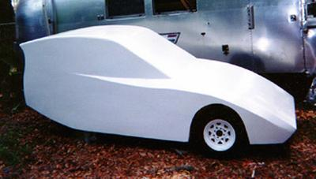

This is a 3-wheeler "tadpole" EV with 2 steerable front wheels, 1 driven
rear wheel, and 2 side-by-side seats.

[Business plan](/wiki/Business_plan_for_the_Freedom_EV "wikilink")
------------------------------------------------------------

Specifications
--------------

### Dimensions

-   height 55"
-   width 60"
-   length 133"
-   wheelbase 95"
-   tread (front) 58"
-   turning radius (?)
-   ground clearance 7"

### Weight

-   empty 550 lbs
-   payload 500 lbs max
-   batteries 750 lbs max
-   GVWR 1800 lbs

### Estimated Performance

-   top speed 80 mph
-   accelleration 0-30 mph
-   accelleration 0-60 mph
-   time, 1/4-mile
-   range at constant 30 mph 125 miles
-   range at constant 60 mph 90 miles

Subsystems
----------

These are not all decided yet; choices here are the current favorites.
Links on each item go to pages with more options and information
involved in the decision process.

### Tires

-   front 155/80R13 radial, 22.8" diameter
-   rear 155/80R13 radial, 22.8" diameter

### Brakes

-   front disc
-   rear disc

### [Motor](/wiki/Motor_and_controller "wikilink")

-   type, series DC; Advanced DC 6.7" L91-4001

### [Controller](/wiki/Motor_and_controller "wikilink")

-   DC 600 amp PWM controller

### [Suspension](/wiki/FreedomEV_Suspension "wikilink")

-   front double unequal length A arms, air adjustable shock absorbers)
-   rear trailing arm, Gates Polychain belt drive to motor

### [Steering](/wiki/FreedomEV_Steering "wikilink")

-   type rack and pinion

### [Batteries](/wiki/FreedomEV_Batteries "wikilink")

-   type (twelve 6v flooded golf cart batteries, Trojan T-105 or
    equivalent?)
-   battery box 36" wide x 45" long x 12" high

### [Body](/wiki/FreedomEV_Body "wikilink")

-   composite one-piece body/chassis
-   doors yes ;-)

### Interior & accessories

-   seats 2, side-by-side buckets 48" wide cabin
-   heater
-   air conditioner
-   radio (any double DIN unit, if you don't install the in-dash
    computer)
-   [Instrument cluster](/wiki/Instrument_cluster "wikilink")
-   [In-dash computer](/wiki/In-dash_computers_and_touchscreens "wikilink")
    (gumstix with a high-reliability LCD touchscreen)
