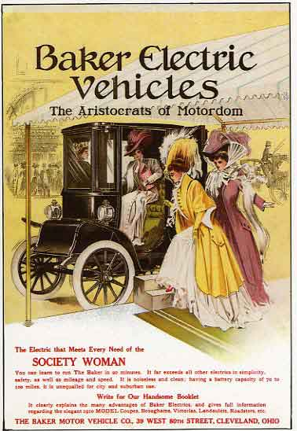

 At
the beginning of the 20th century, as the "horseless carriage" was being
developed, there were 3 favored options for propulsion: a steam engine
(like the trains of the era), an internal combustion engine, or an
electric motor. Women tended to prefer electric cars because they were
clean and didn't require cranking the engine over by hand; while the men
often preferred the gasoline-powered engine. And gasoline was incredibly
cheap then, even when you account for inflation. It was a byproduct from
the oil refineries which did not have many uses, and in some cases was
simply discarded by dumping it on the ground.

Now in the 21st century, with crude oil prices setting new records
periodically, and our newfound concern about the global warming which we
may have wrought upon this world, and the smog in our cities which
changes local weather patterns and affects the health of everyone, it is
becoming increasingly clear that gasoline must eventually be obsolete.
Economic forces will soon push us willy-nilly toward any other option
that we can grasp, as the supply is no longer keeping up with the demand
of so many people who all want their own wheels. We expect to face this
change within our own lifetimes.

Many people do not believe that electric cars could possibly be a
practical alternative, simply because the first image that pops into
their minds is probably the humble golf cart. And the government, always
subject to the influence of lobbyists with ulterior motives, is telling
us that hydrogen is the fuel of the future; even though there is no
obvious source for so much hydrogen, to satiate the appetite of
Americans for fast transportation, even if we leave the rest of the
world to its own devices. The thing is, while they dream up this
pie-in-the-sky future and make plans that will take decades to
materialize (at least until that idea falls out of vogue again), it's
been possible for many decades already to build an electric car that
will go down the freeway just as well as the gas-powered ones, and will
handle your daily commute and errands reliably. What was possible in the
early 20th century has improved since then, just as gas-powered engines
have evolved.

Because computers have become commonplace and cheap, and there are so
many skilled programmers, an idea called "open source" has taken off
exponentially in the past decade. The most creative programmers are
pooling their spare time to build free software, which anyone can use,
and anyone can fix problems, or make improvements, and give those
changes to the world. If you are reading this page with the
[Firefox](http://www.mozilla.com/firefox/) browser, then you are already
benefitting from the open source movement.

We think the time is right for the "open source" car. It will be a car
for the people which is built by the people, and keeps up with the
traffic of the rest of the people on the freeway.

On these pages we aim to detail exactly how it's possible. So read on,
and keep in mind that your ideas matter too, and we want to hear about
them! We invite you to change and improve every page, and to write your
own dreams. If we work together, maybe all our wishes can be fulfilled.

Our first car, the Freedom EV
-----------------------------

Want to break free from oil dependence, but continue to experience the
freedom of the open highway? Want to keep your free time to yourself,
not spend too much of it building your own car? The [Freedom
EV](/wiki/Freedom_EV "wikilink") is going to be one of your best choices.
[Jerry Dycus](/wiki/Jerry_Dycus "wikilink") is setting up production of these,
and has some great momentum going. It's a grassroots project, no big
capitalist financing involved, which means that for now it's a kit car.
As the momentum builds, Jerry plans to get the bodies into larger-scale
production, and eventually to sell finished cars. [A few
others](/wiki/EVProduction:Community_Portal "wikilink") are hashing out the
rest of the details.

-   [Business plan for the Freedom
    EV](/wiki/Business_plan_for_the_Freedom_EV "wikilink")
-   [Latest Progress](/wiki/Progress_Pics "wikilink")
-   [The Yahoo group](http://autos.groups.yahoo.com/group/EVProduction/)

Other Production EV's
---------------------

-   [The Solectria Sunrise](http://www.austinev.org/evalbum/655.html)
    did not make it into production as fast as planned, but it just
    might get there yet! We're working on it...
-   [The Sparrow](http://www.myersmotors.com/) was introduced in 1999,
    sold for a couple years, and now once again you can buy it. It is
    freeway capable, but holds only one person. Think of it as an
    enclosed, safer motorcycle.
-   [Other vehicle types](/wiki/Proposed_vehicle_types "wikilink") that have
    been proposed by members of the EVProduction club
-   [Enabling technologies](/wiki/Enabling_technologies "wikilink")
-   [Rules & regulations](/wiki/Rules_&_regulations "wikilink")
-   [Pipe dreams](/wiki/Pipe_dreams "wikilink")

Conversions
-----------

The traditional way to get your own electric car has been to buy a used
car, remove the engine, replace it with an electric motor, and add
batteries into every nook and cranny that you can find. It began to be a
popular idea during the energy crisis in the 1970's, but is still being
done today. The advantage of this approach is that it's fairly direct,
and many fairly ambitious back-yard mechanics are capable of doing it.
The trouble is that the car was not designed to be electric, and most
such cars will not perform as well as one that is designed for it.

-   [evalbum.com - a gallery of hobbyist-built
    cars](http://evalbum.com), mostly conversions

EV's in general
---------------

-   [Existing vehicles](/wiki/Existing_vehicles "wikilink")
-   [EVs in the press](/wiki/EVs_in_the_press "wikilink")
-   [The EV Discussion List](http://www.evdl.org/)
