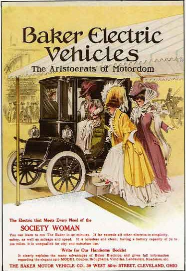

<figure>
<figcaption>Baker</figcaption>
</figure>At the beginning of the 20th century, as the "horseless
carriage" was being developed, there were 3 favored options for
propulsion: a steam engine (like the trains of the era), an internal
combustion engine, or an [electric motor](electric_motor "wikilink").
Women tended to prefer electric cars because they were clean and didn't
require cranking the engine over by hand; while the men often preferred
the gasoline-powered engine. And gasoline was incredibly cheap then,
even when you account for inflation. It was a byproduct from the oil
refineries which did not have many uses, and in some cases was simply
discarded by dumping it on the ground.

Now in the 21st century, with crude oil prices setting new records
periodically, and our newfound concern about the [global
warming](global_warming "wikilink") which we may have wrought upon this
world, and the smog in our cities which changes local weather patterns
and affects the health of everyone, it is becoming increasingly clear
that gasoline and other petroleum products must eventually be obsolete.
Economic forces will soon push us willy-nilly toward any other option
that we can grasp, as the supply is no longer keeping up with the demand
of so many people who all want their own wheels. We expect to face this
change within our own lifetimes.

Many people do not believe that electric cars could possibly be a
practical alternative, simply because the first image that pops into
their minds is probably the humble [golf cart](golf_cart "wikilink") or
a vehicle with a short range. And the government, always subject to the
influence of lobbyists with ulterior motives, is telling us that
hydrogen is the fuel of the future; even though there is no obvious
source for so much hydrogen, to satiate the appetite of Americans for
fast transportation, even if we leave the rest of the world to its own
devices. The thing is, while they dream up this pie-in-the-sky future
and make plans that will take decades to materialize (at least until
that idea falls out of vogue again), it's been possible for many decades
already to build an electric car that will go down the freeway just as
well as the gas-powered ones, and will handle your daily commute and
errands reliably. What was possible in the early 20th century has
improved since then, just as gas-powered engines have evolved.

Because computers have become commonplace and cheap, and there are so
many skilled programmers, an idea called "open source", including [open
source hardware](open_source_hardware "wikilink"), has taken off
exponentially in the past decade. The most creative programmers are
pooling their spare time to write free programs and operating systems,
which anyone can use, and anyone can fix problems, or make improvements,
and give those changes to the world. If you are reading this page with
the [Firefox](http://www.mozilla.com/firefox/) browser or uses
[Linux](wikipedia:Linux "wikilink"), then you are already benefitting
from the open source movement. And for almost every other task as well,
some free software is available.

We think the time is right for the electric [open source
vehicle](open_source_vehicle "wikilink"). It will be a car for the
people which is built by the people, and keeps up with the traffic of
the rest of the people on the freeway.

On these pages we aim to detail exactly how it's possible. So read on,
and keep in mind that your ideas matter too, and we want to hear about
them! We invite you to change and improve every page, and to write your
own dreams. If we work together, maybe all our wishes can be fulfilled.

EVProduction club
-----------------

The EVProduction club began life as a [Yahoo mailing
list](http://groups.yahoo.com/group/EVProduction/). The current plan is
to collect dues from members to fund the club's projects.

This group is for the purpose of getting BEV's into production by group
effort. The auto companies will not do it so we must do it ourselves. We
intend to enable start up of [open
hardware](wikipedia:open_hardware "wikilink") EV production lines and
standards of several types of EV's done by group vote with money raised
by the group.

These could be either proposals by people to the group or by the group
designing the EV's and putting it out to bid to be built in whatever
manner the group decides.

There will be dues as decided by the elected board and once an EV plan
is decided, production slots will be first deposit, first unit basis.

By spreading the costs amoung many we can keep the risk very low and
with our experience in EV's do them right.

The EVProduction club is for those who want EV's on the market and
willing to help make it happen.

-   [Bootstrap to develop
    ideas](http://www.bootstrapaustin.org/wiki/index.php/Welcome_to_the_Bootstrap_Network)
    and [online
    financing](http://www.bootstrapaustin.org/wiki/index.php/Bootstrap_Online_Financing).

EVProduction's vehicles and goods
---------------------------------

EVProduction vehicles and goods uses own solutions and as much as
possible other open solutions, specially [OSCar](/wiki/OSCar "wikilink").

You can propose improvements and ideas although they are not in the
market, to develop them.

### Our first car, the Freedom EV

Want to break free from nuclear-[oil
dependence](oil_dependence "wikilink"), but continue to experience the
freedom of the open highway? Want to keep your free time to yourself,
not spend too much of it building your own car? The [Freedom
EV](/wiki/Freedom_EV "wikilink") is going to be one of your best choices.
[Jerry Dycus](/wiki/Jerry_Dycus "wikilink") is setting up production of these,
and has some great momentum going. It's a grassroots project, no big
capitalist financing involved, which means that for now it's a kit car.
As the momentum builds, Jerry plans to get the bodies into larger-scale
production, and eventually to sell finished cars. [A few
others](/wiki/EVProduction:Community_Portal "wikilink") are hashing out some
of the other details.

-   [Latest Progress](/wiki/Progress_Pics "wikilink")
-   [The Yahoo group](http://autos.groups.yahoo.com/group/EVProduction/)

### Other EVProduction Goods

-   [EVProduction vehicles](/wiki/EVProduction_vehicles "wikilink").
-   [EVProduction complements](/wiki/EVProduction_complements "wikilink"),
    including a range extender [baset trailer](baset_trailer "wikilink")

Other EV's
----------

### Open source

-   [SSM Open Source Green Vehicle](http://www.osgv.org/).
-   [EVWare](http://www.fastbk.com/EVware/)
-   [OSCar](/wiki/OSCar "wikilink")

### Proprietary

-   [The Sparrow](http://www.myersmotors.com/) was introduced in 1999,
    sold for a couple years, and now once again you can buy it as the
    NmG (No more Gas). It is freeway capable, but holds only one person.
    Think of it as an enclosed, safer motorcycle.
-   [The Solectria Sunrise](http://www.austinev.org/evalbum/655.html)
    did not make it into production as planned, but it just might get
    there yet! We're working on it...

Other technologies and parts
----------------------------

-   [Enabling technologies](/wiki/Enabling_technologies "wikilink")
-   [Pipe dreams](/wiki/Pipe_dreams "wikilink")

Rules and regulations
---------------------

-   [Rules & regulations](/wiki/Rules_&_regulations "wikilink")

Conversions
-----------

The traditional way to get your own electric car has been to buy a used
car, remove the engine, replace it with an electric motor, and add
batteries. (To optimize the range, you typically want about half the
gross weight to be batteries.) It began to be a popular idea during the
energy crisis in the 1970's, but is still being done today. The
advantage of this approach is that it's fairly direct, and many fairly
ambitious back-yard mechanics are capable of doing it. The trouble is
that the car was not designed to be electric, and most such cars will
not perform as well as one that is designed for it.

-   [evalbum.com - a gallery of hobbyist-built
    cars](http://evalbum.com), mostly conversions
-   [One popular
    book](http://www.amazon.com/gp/product/0830642315/qid=1134363859/sr=8-2/ref=pd_bbs_2/103-1555072-2363021?n=507846&s=books&v=glance)
    and
    [another](http://www.amazon.com/gp/product/1879857944/qid=1134363859/sr=8-1/ref=pd_bbs_1/103-1555072-2363021?n=507846&s=books&v=glance)
    about the subject
-   [The EV Discussion List](http://www.evdl.org/) is the best forum for
    techie discussion regarding electric vehicles in general, and
    especially back-yard conversions.
-   [John Wayland's
    conversion](http://www.plasmaboyracing.com/whitezombie.php) happens
    to run 12-second 1/4 mile races

One can use also a [glider](glider "wikilink") and install an EV motor.

EV myths
--------

-   [They are too slow, I don't want a golf
    cart](/wiki/They_are_too_slow,_I_don't_want_a_golf_cart "wikilink")
-   [Electricity pollutes the air just as much as
    gasoline](/wiki/Electricity_pollutes_the_air_just_as_much_as_gasoline "wikilink")
-   [Electricity is dangerous](/wiki/Electricity_is_dangerous "wikilink")
-   [Batteries will spill acid all over in an
    accident](/wiki/Batteries_will_spill_acid_all_over_in_an_accident "wikilink")

EV's in general
---------------

-   [EVs in the press](/wiki/EVs_in_the_press "wikilink")
-   [Links](/wiki/Links "wikilink")
-   [EV Maintenance Resources](/wiki/EV_Maintenance_Resources "wikilink")
