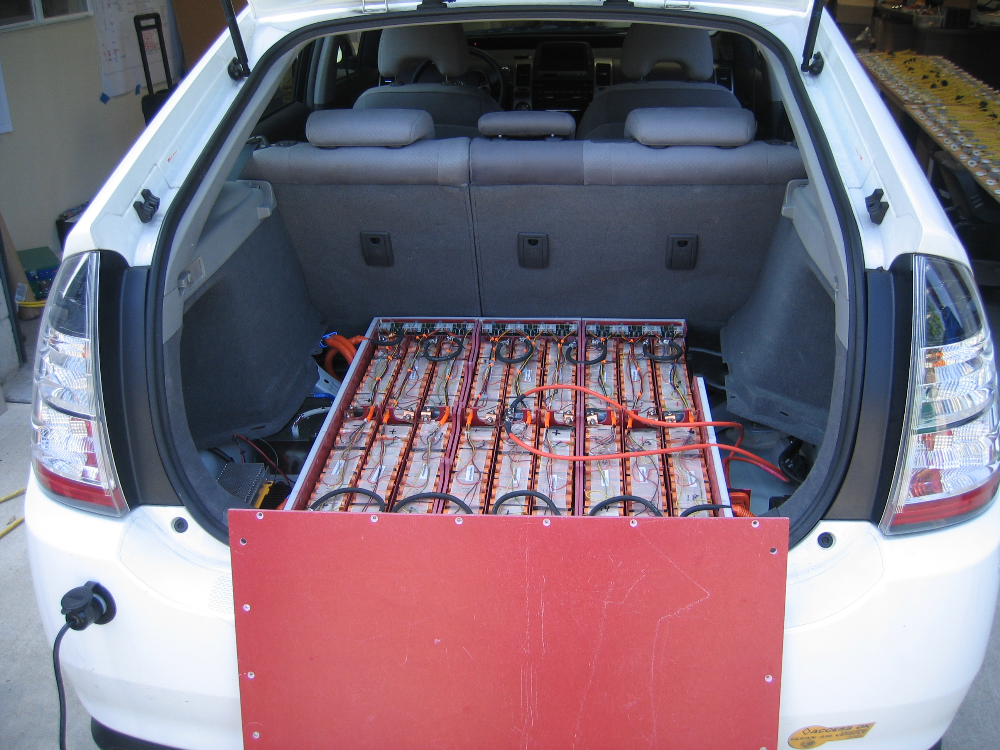
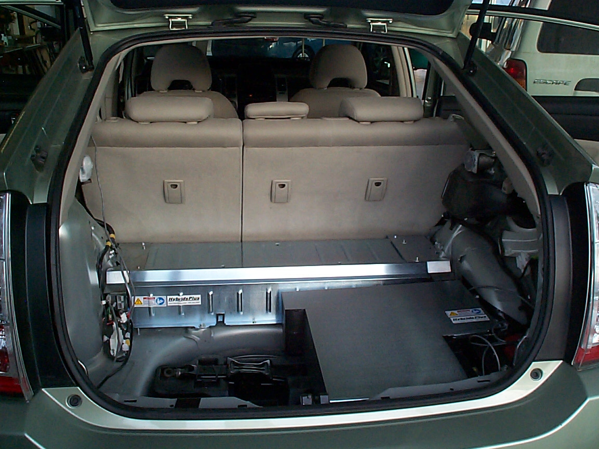
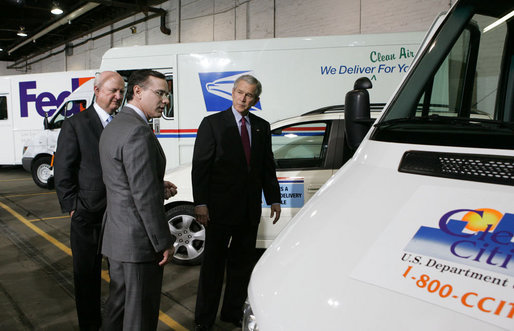
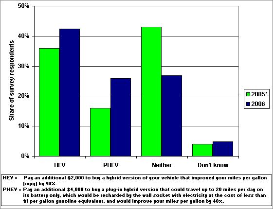

<figure>
<figcaption><a href="Lithium-ion_battery" title="wikilink">Lithium-ion battery</a> pack, with cover removed, in CalCars plug-in hybrid converted <a href="Toyota_Prius" title="wikilink">Toyota Prius</a>.</figcaption>
</figure>A **plug-in hybrid [electric
vehicle](electric_vehicle "wikilink")** (PHEV) is a [hybrid
vehicle](hybrid_vehicle "wikilink") with onboard energy storage that can
be recharged by connecting a plug to an [electrical power
source](/wiki/Electricity_generation "wikilink"). Plug-in hybrids have
characteristics of both conventional [hybrid electric
vehicles](/wiki/Petroleum_electric_hybrid_vehicle "wikilink") and of [battery
electric vehicles](battery_electric_vehicle "wikilink"). While PHEVs are
usually passenger vehicles, they can also be commercial passenger
vans,[1] utility trucks,[2][3] school buses,[4] scooters,[5] and
military vehicles.[6] PHEVs are sometimes called "grid-connected
hybrids," "gas-optional hybrids" (GO-HEVs) or "full hybrids."

Plug-in hybrids use no [fossil fuel](fossil_fuel "wikilink") during
their [all-electric range](all-electric_range "wikilink") to the extent
that their batteries are charged from sources such as [wind
power](wind_power "wikilink"), [hydropower](hydropower "wikilink"), or
[nuclear energy](nuclear_energy "wikilink"). As of 2007, the cost for
electricity to power plug-in hybrids during all-electric operation in
California has been estimated as less than one fourth the cost of
gasoline.[7] PHEVs also have the potential to help reduce [air
pollution](air_pollution "wikilink") as well as dependence on
[petroleum](petroleum "wikilink") and help mitigate [global
warming](global_warming "wikilink") by producing less [greenhouse
gases](greenhouse_gases "wikilink") than conventional vehicles. Other
potential benefits include improved national [energy
security](energy_security "wikilink"), fewer fill-ups at the gas
station, the convenience of home recharging, opportunities to provide
emergency backup power in the home, and the potential for [vehicle to
grid](vehicle_to_grid "wikilink") applications.[8]

As of April 2007, plug-in hybrid passenger vehicles are not yet in
production. However, [Toyota](/wiki/Toyota "wikilink")[9] and [General
Motors](/wiki/General_Motors "wikilink")[10] may introduce production PHEV
automobiles as early as 2009. Conversions of production model [hybrid
vehicles](hybrid_vehicle "wikilink") are available from conversion kits
and conversion services. Many existing PHEVs are conversions of 2004+
[Toyota Prius](/wiki/Toyota_Prius "wikilink") hybrid cars, which extend their
electric-only range and add plug-in charging.

A plug-in hybrid's [all-electric range](all-electric_range "wikilink")
is designated by PHEV-(miles) or PHEV(kilometers)km representing the
distance the vehicle can travel on electric power alone. For example, a
PHEV-20 can travel twenty miles without using its internal combustion
engine, or about 32 kilometers, so it may also be designated as
PHEV32km.

History
-------

### 1899-1999

[Hybrid vehicles](/wiki/Hybrid_vehicles "wikilink") were produced beginning as
early as 1899 by Lohner-[Porsche](/wiki/Porsche "wikilink"). Early hybrids
could be charged from an external source before operation. However, the
term "plug-in hybrid" has come to mean a hybrid vehicle that can be
charged from a standard electrical wall socket.

The July 1969 issue of [Popular Science](/wiki/Popular_Science "wikilink")
featured an article on the [General Motors
XP-883](/wiki/General_Motors_XP-883 "wikilink") plug-in hybrid. The concept
commuter vehicle housed six 12-volt lead acid batteries in the trunk
area and a transverse-mounted DC electric motor turning a front-wheel
drive trans-axle. The gasoline powered engine was connected to the
trans-axle via a worm gear.[11] The car could be plugged into a standard
110 Volt AC outlet for recharging.

The September 1975 issue of [Popular
Science](/wiki/Popular_Science "wikilink")
[featured](http://www.popsci.com/popsci/automotivetech/c45d3bcc2eb84010vgnvcm1000004eecbccdrcrd.html)
a cover story on an experimental "turbo-electric" hybrid that "plugs in
overnight for thrifty driving around town." Built by electronics
engineer Harry Grepke, the vehicle used eight 12-volt truck batteries
and a turbine genset. Grepke claimed an [all-electric
range](all-electric_range "wikilink") of 50 miles.[12]

In 1989, [Audi](/wiki/Audi "wikilink") produced its first iteration of the
Audi Duo, a plug-in parallel hybrid based on the [Audi
100](/wiki/Audi_100 "wikilink") Avant [Quattro](Quattro "wikilink"). This car
had a 12.6 bhp [Siemens](/wiki/Siemens "wikilink") [electric
motor](electric_motor "wikilink") which drove the rear wheels. A
trunk-mounted [nickel](nickel "wikilink")-[cadmium](cadmium "wikilink")
battery supplied [energy](energy "wikilink") to the motor that drove the
rear wheels. The vehicle's front wheels were powered by a 2.3-litre
five-cylinder engine with an output of 136 bhp. The intent was to
produce a vehicle which could operate on the engine in the country and
electric mode in the city. Mode of operation could be selected by the
driver. Just ten vehicles are believed to have been made; one drawback
was that due to the extra weight of the electric drive, the vehicles
were less efficient when running on their engines alone than standard
Audi 100s with the same engine.

Beginning around 1990, Professor [Andy
Frank](/wiki/Andrew_A._Frank "wikilink") of the [University of California,
Davis](/wiki/University_of_California,_Davis "wikilink") began using student
teams to build operational prototype Plug-in hybrid electric vehicles.
His work attracted industry support and funding from
[Nissan](/wiki/Nissan "wikilink"), [Koyo Seiko](/wiki/Koyo_Seiko "wikilink"),
[General Motors](/wiki/General_Motors "wikilink"),
[Saturn](/wiki/Saturn "wikilink"), [Ford](Ford "wikilink"),
[Visteon](/wiki/Visteon "wikilink"), JATCO, [Ovonics](/wiki/Ovonics "wikilink"), the
[Defense Advanced Research Project
Agency](/wiki/Defense_Advanced_Research_Project_Agency "wikilink") (DARPA),
[Sacramento Municipal Utility
District](/wiki/Sacramento_Municipal_Utility_District "wikilink"), [Southern
California Edison](/wiki/Southern_California_Edison "wikilink"), the [United
States Department of
Energy](/wiki/United_States_Department_of_Energy "wikilink"), and others. The
UC Davis PHEVs won several DOE/USCAR "Future Car" and "Future Truck"
national competitions.

In 1994, the [Esoro H301](/wiki/Esoro_H301 "wikilink") two-door, four
passenger plug-in hybrid sedan was built in
[Switzerland](/wiki/Switzerland "wikilink") by the vehicle prototyping company
[Esoro AG](/wiki/Esoro_AG "wikilink").[13] Four such prototypes are still on
the road. The lightweight (710 kg/1565 lb) vehicle featured a 360cc
engine in parallel with a 34 kW air-cooled AC [induction
motor](induction_motor "wikilink"). The 9 kWh nickel-cadmium battery
could be recharged in four hours from a 220v electrical wall outlet, or
from 30% to 80% [state of charge](state_of_charge "wikilink") in about
two hours at a steady speed of 120km/h.[14]

In 1998, Audi premiered a second iteration of the Duo plug-in hybrid,
based on the [Audi A4](/wiki/Audi_A4 "wikilink"), at the [Frankfurt Motor
Show](/wiki/Frankfurt_Motor_Show "wikilink"). The 1998 Audi Duo featured a
parallel configuration similar to its predecessor. At the time, hybrid
propulsion was considered as a promising solution to Europe's inner city
emissions problems. Audi AG leased ten Duo PHEVs to Solarmobilverein
Erlangen in the city of [Erlangen](/wiki/Erlangen "wikilink"),
[Bavaria](/wiki/Bavaria "wikilink") as part of ELCIDIS (**El**ectric Vehicle
**Ci**ty **Dis**tribution), an advanced mobility project funded by the
[European Commission](/wiki/European_Commission "wikilink").[15] Solar
recharging stations were envisioned, but were not built. The fleet trial
ended in August 2001.

About sixty 1998-1999 Audi Duo PHEVs were built. However, few customers
were prepared to pay twice the price as the base model A4 equipped with
an identical diesel engine, and series production was stopped.

### 2000-2005

2000  

The [Electric Power Research
Institute](/wiki/Electric_Power_Research_Institute "wikilink") (EPRI)
sponsored the Hybrid Electric Vehicle Alliance to promote and develop
[original equipment
manufacturer](original_equipment_manufacturer "wikilink")
commercialization of plug-in hybrid electric vehicles. Alliance members
include major automakers, national labs, utilities, and the University
of California at Davis. [EPRI](/wiki/EPRI "wikilink")'s Hybrid Electric
Vehicle Working Group published reports on PHEV attractiveness. Dr.
Frank received new support from the [European
Commission](/wiki/European_Commission "wikilink"), Southern California Air
Quality Management District, Yolo-Solano Air Quality Management
District, [California Air Resources
Board](/wiki/California_Air_Resources_Board "wikilink"), and other
governmental agencies.

2001  

The U.S. [Department of Energy](/wiki/Department_of_Energy "wikilink") created
the National Center of Hybrid Excellence at UC Davis, with Dr. Frank as
Director. Dr. Frank also obtained substantial GM funds to hybridize and
plug-in GM's EV1.[EPRI](/wiki/EPRI "wikilink")'s Hybrid Electric Vehicle
Working Group (HEVWG) published a report on costs and efficiencies of
hybrid and plug-in hybrid vehicles.[16] The report evaluated a small
car, a midsize car, and an SUV, and simulated four powertrains for each
vehicle: a conventional powertrain, a parallel HEV, a PHEV-20, and a
PHEV-60.

2002  

Entrepreneurs, environmentalists and engineers created the [California
Cars Initiative](/wiki/California_Cars_Initiative "wikilink")
[(www.calcars.org.)](http://www.calcars.org/) CalCars is a non-profit
PHEV advocacy and technology development group.

2003  

Renault began selling the Elect'Road, a plug-in series hybrid version of
their popular [Kangoo](/wiki/Kangoo "wikilink"), in Europe. It was sold
alongside Renault's "Electri'cite" electric-drive Kangoo battery
electric van. The Elect'Road had a 150 km range using a [nickel-cadmium
battery](nickel-cadmium_battery "wikilink") pack and a 500cc, 16 kW
liquid-cooled gasoline "range-extender" engine. It powered two high
voltage/high output/low volume alternators, each of which supplied up to
5.5kW at 132V at 5000 rpm. The operating speed of the internal
combustion engine (and therefore the output delivered by the generators)
varied according to demand. The fuel tank had a capacity of 10 litres
and was housed within the right rear wheel arch. The range extender
function was activated by a switch on the dashboard. The on board 3.5kW
charger could charge a delpted battery pack to 95% SOC in about four
hours from 220 volts. Passenger compartment heat was powered by the
battery pack as well as an auxiliary coolant circuit that was heated by
the range extender engine. Renault discontinued the Elect'Road after
selling about 500, primarily in France, Norway and the UK, for about
25,000 euros.[17]

With support from the [Southern California Air Quality Management
District](/wiki/Southern_California_Air_Quality_Management_District "wikilink"),
the [California Air Resources
Board](/wiki/California_Air_Resources_Board "wikilink"), the [National
Renewable Energy
Laboratory](/wiki/National_Renewable_Energy_Laboratory "wikilink"), the
[Electric Power Research
Institute](/wiki/Electric_Power_Research_Institute "wikilink"), and
[Volkswagen](/wiki/Volkswagen "wikilink"), Alan Cocconi of [AC
Propulsion](/wiki/AC_Propulsion "wikilink") converted a [Volkswagen
Jetta](/wiki/Volkswagen_Jetta "wikilink") into a plug-in series hybrid. The
engine was replaced with a 120-kW electric motor and 8.7 kWh’s worth of
lead-acid batteries, which were charged by a trunk-mounted 1.4-liter
internal combustion engine from a [Volkswagen
Lupo](/wiki/Volkswagen_Lupo "wikilink").[18]

In the same year, Professor Frank's vehicles were shown at the Paris
International Auto Show and demonstrated to about 200 Renault engineers
at its Paris headquarters. During the same year, Toyota shipped a
University of California Davis Coulomb Plug-in Hybrid Electric Vehicles
to [Toyota City](/wiki/Toyota_City "wikilink") to demonstrate it to about 250
engineers and executives at two of [Toyota](/wiki/Toyota "wikilink")'s primary
Tier 1 suppliers, [Koyo Seiko](/wiki/Koyo_Seiko "wikilink"), and Aisin AW
(Aisin built the 1998-2003 [Toyota Prius](/wiki/Toyota_Prius "wikilink")
hybrid transaxle, as well as those used in the [Ford Escape
Hybrid](/wiki/Ford_Escape_Hybrid "wikilink"), [Toyota Camry
Hybrid](/wiki/Toyota_Camry_Hybrid "wikilink"). and Nissan Altima Hybrid).

2004  

In September, the [California Cars
Initiative](/wiki/California_Cars_Initiative "wikilink") converted a 2004
Toyota Prius into a prototype of what it calls the PRIUS+. With the
addition of 130 kg (300 lb) of [lead-acid
batteries](lead-acid_batteries "wikilink"), the PRIUS+ achieved roughly
double the gasoline [mileage](mileage "wikilink") of a standard Prius
and can make trips of up to 15 km (10 miles) using only electric
power.[19] The vehicle, which is owned by CalCars technical lead Ron
Gremban, is used in daily driving, as well as a test bed for various
improvements to the system.

Also in September, DaimlerChrysler displayed a plug-in hybrid version of
its popular [Mercedes-Benz](/wiki/Mercedes-Benz "wikilink") Sprinter 311 CDI
commercial van at the 2004 [Internationale
Automobil-Ausstellung](/wiki/Internationale_Automobil-Ausstellung "wikilink")
Commercial Vehicle Show in [Frankfurt](/wiki/Frankfurt "wikilink"),
[Germany](/wiki/Germany "wikilink").[20] The diesel-engine PHEV Sprinters had
a maximum all electric range of 30 kilometers. Hand-built in
[Sindelfingen](/wiki/Sindelfingen "wikilink"), Germany by Mercedes-Benz, the
vehicles were tested around the clock, and some were placed in
commercial fleet environments. The PHEV Sprinter's engine could be
turned off by the driver for operation in historic European city centers
that had outlawed internal-combustion engines.

By the end of the year, Dr. Frank's student teams had built and operated
seven proof-of-concept and proof-of-demonstration prototype Plug-in
Hybrid Electric Vehicles, including 6-passenger sedans (Taurus and
Sable), Sport Utility Vehicles (Suburban, Explorer), two-seater sports
car (GM EV1), and two ground-up 80 mpg sports cars, and the CalCars
PRIUS+ prototype and EDrive Systems conversions were demonstrated.

2005  

Additional [DaimlerChrysler](/wiki/DaimlerChrysler "wikilink") [Mercedes-Benz
Sprinter](/wiki/Mercedes-Benz_Sprinter "wikilink") 15-passenger
[van](van "wikilink") PHEV prototypes were completed.[21] EPRI, along
with a number of utilities and government agencies, worked with
DaimlerChrysler to deliver 4 Sprinter PHEV vans to test fleets.[22]

In August, four companies - [Raser
Technologies](/wiki/Raser_Technologies "wikilink"), [Maxwell
Technologies](/wiki/Maxwell_Technologies "wikilink"),
[Electrovaya](/wiki/Electrovaya "wikilink"), and [Pacific Gas and
Electric](/wiki/Pacific_Gas_and_Electric "wikilink") - formed the Plug-In
Hybrid Consortium[23][24] to help reduce the research and design gap
between component suppliers and OEMs and to accelerate the development
of critical PHEV components. Since then, nine other component companies
and three more utility companies, as well as
[CalCars](/wiki/CalCars "wikilink") and [Plug In
America](/wiki/Plug_In_America "wikilink"), have joined the consortium.

### 2006

<figure>
<figcaption>Hybrids Plus PHEV <a href="Toyota_Prius" title="wikilink">Toyota Prius</a> with PHEV-15 pack in place of original pack and extension pack (for PHEV-30) on the side, retaining tire access</figcaption>
</figure>At the [UC Davis](/wiki/UC_Davis "wikilink") Hybrid Center, teams led
by Professor [Andrew A. Frank](/wiki/Andrew_A._Frank "wikilink") have been
designing and building working prototypes, installed into a GM Equinox
for the [Challenge X](/wiki/Challenge_X "wikilink") competition.[25]

PHEV conversions of [IVECO](/wiki/IVECO "wikilink") medium-duty
[diesel](diesel "wikilink")-powered commercial vehicles, sold as Hybrid
Daily Bimodales, are offered by Micro-Vett SPA of
[Imola](/wiki/Imola "wikilink"), [Italy](Italy "wikilink") in truck, 9-
passenger van, and 20-passenger schoolbus configurations.[26] Micro-Vett
offers their conversions with either lead-acid or lithium-ion battery
packs, which have an advertised all-electric range of 25 kilometers, or
45 to 100 kilometers, respectively.[27]

February: [Hymotion](http://www.hymotion.com), a Canadian company,
introduced plug-in hybrid upgrade kits in February 2006. Designed for
the Toyota Prius and the Ford Escape and Mariner Hybrids, these kits
were offered to fleet buyers at first and are projected to be available
to the general public in 2007.

April 14: Piaggio, the Italian manufacturer of Vespa scooters, announced
that it had built two parallel-architecture plug-in hybrid prototypes
based on the standard Vespa LX 50 and X8 125 models.[28]

May 17: Representatives of academia, government, and the utility and
auto industries testified before the House Science Subcommittee on
Energy in support of proposed legislation that would advance the
commercialization of plug-in hybrid electric vehicles.[29]

May: Ryan Fulcher and Rich Rudman of Manzanita Micro converted Fulcher's
Prius to a plug-in hybrid, using components that would lead to the
introduction of a Manzanita Micro charger kit for PHEV conversions.

July 5: [Hybrids Plus](/wiki/Hybrids_Plus "wikilink") of Boulder, Colorado
began offering plug-in hybrid conversions of the 2004 and later Toyota
Prius, using [A123](http://www.a123systems.com/)
[Li-ion](/wiki/Lithium_ion_polymer_battery "wikilink") batteries for either a
15 or 30 mile [all-electric range](all-electric_range "wikilink").Their
first contract was with the Colorado Office of Energy Management and
Conservation, which ordered one plug-in Prius conversion. The vehicle
was handed over to Colorado OEMC on March 6, 2007.

July 18: [Toyota](/wiki/Toyota "wikilink") announced that it "plans to develop
a hybrid vehicle that will run locally on batteries charged by a typical
120-volt outlet before switching over to a gasoline engine for longer
hauls."<ref name="toyota"> The next major update to the Toyota Prius is
said to use [lithium ion
batteries](lithium_ion_batteries "wikilink").[30] Toyota’s fuel economy
target for the upcoming next-generation Prius has been reported to be 40
kilometers/liter (2.5 l/100km, or 94 mpg US.)[31]

August: PML Flightlink unveiled an in-wheel, plug-in series hybrid
conversion of a MINI at the British Motor Show, the MINI QED.[32] PML
claimed fuel economy of 80 mpg, 0 to 60mph in 4.5 seconds, top speed of
over 150mph, and a range of 1,000 miles.[33]

October: [Hybrids Plus](/wiki/Hybrids_Plus "wikilink") won a contract to
concert a [Ford Escape Hybrid](/wiki/Ford_Escape_Hybrid "wikilink") to a
plug-in hybrid for the [New York State Energy Research and Development
Authority](/wiki/New_York_State_Energy_Research_and_Development_Authority "wikilink").[34]

November 1: [Manzanita Micro](http://www.manzanitamicro.com) sold their
first [PiPrius](http://www.eaa-phev.org/wiki/PiPrius) conversion kit
using their PFC charger and [battery
regulator](battery_regulator "wikilink") as a [DC to DC
converter](/wiki/DC_to_DC_converter "wikilink") and rapid [battery
charger](battery_charger "wikilink") system. [Chelan County’s Advanced
Vehicle Initiative](http://www.plugincenter.com) received the first
conversion kit from Manzanita Micro in October of 2006. As of April 2007
the fourth and fifth such conversions were underway.

November 29: GM announced plans to introduce a production plug-in hybrid
version of [Saturn's Greenline Vue SUV](/wiki/Saturn_VUE "wikilink") in
2009[35] with an all electric range of 10 miles.[36]

### 2007

January 7: General Motors' [Chevrolet Volt](/wiki/Chevrolet_Volt "wikilink")
was
[unveiled](http://link.brightcove.com/services/player/bcpid416542521) at
Detroit's [North American International Auto
Show](/wiki/North_American_International_Auto_Show "wikilink").[37] The Volt
is part of GM's E-Flex architecture, which is expected to initially
feature a plug-in capable, battery-dominant series hybrid architecture.
Future E-Flex plug-in hybrid vehicles may use gasoline, diesel, or
hydrogen fuel cell power to supplement the vehicle's battery. General
Motors envisions an eventual progression of E-Flex vehicles from plug-in
hybrids to pure electric vehicles, as battery technology improves.[38]
General Motors presented the Volt as a PHEV-40 that starts its engine
when 40% of the battery charge remains, and which can achieve a fuel
economy of 50 mpg (4.7 l/100 km), even if the vehicle is not plugged
in.[39]

February 28: The [United States Department of
Energy](/wiki/United_States_Department_of_Energy "wikilink") released a draft
of a plan to accelerate the development and deployment of plug-in hybrid
vehicle technology.[40] Specific areas of concern are lithium-ion
batteries, power electronics, and electric motors. The comment period
for the draft has ended, and the DOE is expected to release the final
plan by the end of April 2007.[41]

March 2: The [South Coast Air Quality Management
District](/wiki/South_Coast_Air_Quality_Management_District "wikilink") in
[California](/wiki/California "wikilink") approved a $2.6-million contract for
the conversion of 20 [Ford Escape
Hybrids](/wiki/Ford_Escape_Hybrid "wikilink") and 10 [Toyota
Priuses](/wiki/Toyota_Prius "wikilink") to plug-in hybrids.[42] The SCAQMD
selected [Quantum Technologies](/wiki/Quantum_Technologies "wikilink") and
[Hymotion](/wiki/Hymotion "wikilink") to perform the conversions.

March 14: The [Illinois Institute of
Technology](/wiki/Illinois_Institute_of_Technology "wikilink") delivered a
converted plug-in Ford Escape Hybrid to the
[Chicago](/wiki/Chicago "wikilink") Department of Fleet Management for four to
six months of field testing of the vehicle to evaluate the vehicle's
performance, as well as improvements in fuel efficiency and emission
reduction.[43] The project is sponsored by the City of Chicago, MicroSun
Technologies, [ComEd](/wiki/ComEd "wikilink"), and All Cell, an Illinois
Institute of Technology-based technology transfer company formed in 2001
to commercialize lithium-ion batteries in military, medical, portable,
and transportation applications.

April 9: [Pacific Gas and
Electric](/wiki/Pacific_Gas_and_Electric "wikilink"), California's largest
electric company, announced their support for plug-in hybrids with
[Vehicle to Grid](/wiki/Vehicle_to_Grid "wikilink") capabilities. PG&E
proposed regulatory changes which could allow homeowners to use such
vehicles for back-up electricity in the event of a power
failure.[44][45]

April 23: The [California Air Resources
Board](/wiki/California_Air_Resources_Board "wikilink") Independent Expert
Panel on [Zero Emission Vehicles](zero-emissions_vehicle "wikilink")
published a report[46] that assessed advanced vehicle technologies and
concluded, among other things, that plug-in hybrids "have the potential
to provide significant direct societal benefits and are likely to become
available in the near future."[47]

April 25: Phoenix Motorcars and UQM Technologies announced a
collaborative project to develop a plug-in series hybrid version of the
sport utility truck that Phoenix currently sells as an all-electric
vehicle.[48] The vehicle is projected to use a small gasoline-fueled
internal combustion engine as a range extender and lithium titanate
batteries from Altair Nanotechnologies.

May 1: [A123Systems](/wiki/A123Systems "wikilink")
[lithium-ion](lithium-ion "wikilink") battery company CEO David Vieau
announced that A123 plans to market battery packs in 2008 for
third-party conversion of hybrids to plug-in hybrids. [49]

May 2: [CalCars](/wiki/CalCars "wikilink")
[announced](http://autos.groups.yahoo.com/group/calcars-news/message/755)
that it had received a $200,000 grant from
[Google.org](/wiki/Google.org "wikilink"), the philanthropic arm of
[Google](/wiki/Google "wikilink"), for a two-year period to support its work
in educating the public about plug-in hybrid-electric vehicles. In 2006,
Google.org
[announced](http://www.nytimes.com/2006/09/14/technology/14google.html?ex=1178337600&en=97bb4ac29290de9d&ei=5070)
that it intended to develop a plug-in hybrid of its own.[50]

Technology
----------

<figure>
<figcaption> <a href="Plug-in_hybrid" title="wikilink">Plug-in Hybrid</a> <a href="Mercedes-Benz_Sprinter" title="wikilink">Sprinter</a> in the <a href="U.S._Postal_Service" title="wikilink">U.S. Postal Service</a></figcaption>
</figure>### Powertrains

PHEVs are based on the same three basic
[powertrain](powertrain "wikilink") architectures as conventional
hybrids:

**Series hybrids** use an [internal combustion
engine](internal_combustion_engine "wikilink") (ICE) to turn a
generator, which in turn supplies current to an electric motor, which
then rotates the vehicle’s drive wheels. A battery or capacitor pack, or
a combination of the two, can be used as a buffer of sorts to store
excess charge. Examples of series hybrids include Renault's Kangoo
Elect'Road, Toyota's Japan-only Coaster light-duty passenger bus,
DaimlerChrysler’s hybrid Orion bus (earlier post), the [Chevrolet
Volt](/wiki/Chevrolet_Volt "wikilink") concept vehicle, and many
diesel-electric locomotives. With an appropriate balance of components
this type can operate over a substantial distance with its full range of
power without engaging the ICE. As is the case for other architectures,
**series hybrids** can operate without plugging in as long as there is
liquid fuel in the tank.

**Parallel hybrids**, such as Honda’s Insight, Civic, and Accord
hybrids, can simultaneously transmit power to their drive wheels from
two distinct sources—for example, an internal-combustion engine and a
battery-powered electric drive. Although most parallel hybrids
incorporate an electric motor between the vehicle's engine and
transmission, a parallel hybrid can also use its engine to drive one of
the vehicle's axles, while its electric motor drives the other axle. The
Audi Duo Plug-in hybrid is an example of this type of parallel hybrid
architecture. Parallel hybids can be programmed to use the electric
motor to substitute for the ICE at lower power demands and to
substantially increase the power available to a smaller ICE than would
normally be used, either mode substantially increasing fuel economy
compared to a simple ICE vehicle.

**Series-parallel hybrids** have the flexibility to operate in either
series or parallel mode. Hybrid powertrains currently used by Ford,
Lexus, Nissan, and Toyota, which some refer to as “series-parallel with
power-split,” can operate in both series and parallel mode at the same
time. At present, most plug-in hybrid conversions of conventional
hybrids untilize this architecture.

### Modes of operation

Regardless of its architecture, a plug-in hybrid may be capable of
[charge-depleting](charge-depleting "wikilink") and
[charge-sustaining](charge-sustaining "wikilink") modes. Combinations of
these two modes are termed [blended mode](blended_mode "wikilink") or
mixed-mode. These vehicles can be designed to drive for an extended
range in [all-electric mode](all-electric_mode "wikilink"), either at
low speeds only or at all speeds. These modes manage the vehicle's
battery discharge strategy, and their use has a direct effect on the
size and type of battery required:[51]

**Charge-depleting modes** allow a fully charged PHEV to operate
exclusively (or depending on the vehicle, almost exclusively, except
during hard acceleration) on electric power alone until its battery
state of charge is depleted to a predetermined level, at which time the
vehicle's internal combustion engine or fuel cell will be engaged. This
period is the vehicle's [all-electric
range](all-electric_range "wikilink"). This is the only mode that a
[battery electric vehicle](battery_electric_vehicle "wikilink") can
operate in, thus their limited range.

**Charge-sustaining modes** are those used by production [hybrid
vehicles](hybrid_vehicles "wikilink") (HEV) today, and combine the
operation of the vehicle's two power sources in such a manner that the
vehicle is operating as efficiently as possible without allowing the
battery state of charge to move beyond some predetermined narrow band.
Over the course of a trip in a HEV the state of charge may fluctuate but
will have no net change.[52] The battery in a HEV can thus be thought of
as an energy accumulator rather than a fuel storage device. Once a
plug-in hybrid has exhausted its all-electric range in charge-depleting
mode, it can switch into charge-sustaining mode automatically.

**Blended modes** are a type of charge-depleting mode normally employed
by vehicles which do not have enough electric power to sustain high
speeds without the help of the internal combustion portion of the
powertrain. A blended control strategy typically takes more miles to use
stored grid electricity than a charge-delpleting strategy.[53] The
[Renault Kangoo](/wiki/Renault_Kangoo "wikilink") and some Toyota Prius
conversions are examples of vehicles that use this mode of operation.
The Electri'cité & Elect'road versions of the Relant Kangoo were
charge-depleting battery electric vehicles; the Elect'road had a modest
[internal-combustion engine](internal-combustion_engine "wikilink")
(ICE) which extended its range somewhat. 2004+ Toyota Prius conversions
can only run without using the [ICE](/wiki/ICE "wikilink") at speeds of less
than about 42 mph due to the limits dictates by the vehicle's powertrain
control software, which resides in the Hybrid Vehicle Electronic Control
Unit (HV ECU). However at speeds above this electric power can still be
used to displace gas fuel thus improving the gas mileage when operating
in this mode, generally doubling the MPG.

**Mixed mode** is a particular trip in which a combination of the above
modes are utilized.[54] For example, a PHEV-20 Prius conversion may
begin a trip with 5 miles of low speed charge-depleting, then get onto a
freeway and operate in blended mode for 20 miles, using 10 miles worth
of of AER at twice the MPG. Finally the driver might exit the freeway
and drive for another 5 miles without the ICE until the full 20 miles of
AER were exhausted. At this point the vehicle would revert back to a
charge sustaining-mode for another 10 miles until the final destination
is reached. Such a trip would be considered a mixed mode, as multiple
modes are employed in one trip. This contrasts with a charge-depleting
trip which would be driven within the limits of a PHEV's all electric
range. Conversely, the portion of a trip which extends beyond the AER of
a PHEV would be driven primarily in charge-sustaining mode, much as a
conventional hybrid.

### Batteries

PHEVs typically require deeper
[battery](/wiki/Battery_(electricity) "wikilink") charging and discharging
cycles than conventional hybrids. Because the number of full cycles
influences battery lifetime, battery life may be less than in HEVs which
use a smaller window of . However, some authors argue that PHEVs will
soon become standard in the automobile industry.[55] Design issues and
trade-offs concerning battery life, capacity, heat dissipation, weight,
costs, and safety need to be solved.[56] Advanced battery technology is
under development.[57][58][59] Battery life expectancy is expected to
increase.[60]

The cathodes of some early 2007 lithium-ion batteries are made from
lithium-cobalt metal oxide. This material is expensive, and cells made
with it can release oxygen if its cell is overcharged. If the cobalt is
replaced with [iron
phosphates](/wiki/Lithium_iron_phosphate_battery "wikilink"), the cells will
not burn or release oxygen under any charge. The price premium for early
2007 hybrids is about US $5000, some $3000 of which is for their NiMH
battery packs. At early 2007 gasoline and electricity prices, that would
break even after six to ten years of operation. The hybrid premium could
fall to $2000 in five years, with $1200 or more of that being cost of
lithium-ion batteries, providing a three-year payback.[61]

### Conversions of production hybrids

<figure>
<figcaption>15 <a href="Lead_acid_battery" title="wikilink">lead-acid batteries</a>, PFC charger, and <a href="battery_regulator" title="wikilink">regulators</a> installed into <a href="http://www.eaa-phev.org/wiki/WhiteBird">WhiteBird</a>, a PHEV-10 conversion of a Toyota Prius</figcaption>
</figure>Conversion of an existing production hybrid to a plug-in hybrid
typically involves increasing the capacity of the vehicle's [battery
pack](battery_pack "wikilink") and adding an onboard AC-to-DC charger.
Ideally, the vehicle's powertrain software would be reprogrammed to make
full use of the battery pack's additional energy storage capacity and
power output.

Many early plug-in hybrid [electric vehicle
conversions](electric_vehicle_conversion "wikilink") have been based on
the 2004+ model year [Toyota Prius](/wiki/Toyota_Prius "wikilink"). Some of
the systems have involved replacement of the vehicle's original Ni-MH
battery pack and its electronic control unit. Others, such as Hymotion
as well as builders of the CalCars Prius+, and the PiPrius, piggyback an
additional battery back onto the OEM battery pack, this is also referred
to as Battery Range Extender Modules (BREMs).[62] This has been referred
to as a "hybrid battery pack configuration" within the [electric vehicle
conversion](electric_vehicle_conversion "wikilink") community.[63] Early
[lead-acid battery](lead-acid_battery "wikilink") conversions by CalCars
demonstrated 10 miles (15 km) of EV-only and 20 miles (30 km) of double
mileage [blended mode](blended_mode "wikilink") range.

[EDrive systems](http://www.edrivesystems.com) use
[Valence](http://www.valence.com)
[Li-ion](/wiki/Lithium_ion_polymer_battery "wikilink") batteries and have a
claimed 40 to 50 miles of electric range. Other companies offering
plug-in conversions or kits for the Toyota Prius include
[Hymotion](http://www.hymotion.com), [Hybrids
Plus](/wiki/Hybrids_Plus "wikilink"), and [Manzanita
Micro](http://www.manzanitamicro.com).

The [EAA-PHEV project](http://www.eaa-phev.org) was conceived in October
of 2005 to accelerate efforts to document existing HEVs and their
potential for conversion into PHEVs. The [Electric Auto
Association](/wiki/Electric_Auto_Association "wikilink")-PHEV "Do-It-Yourself"
[Open Source](/wiki/Open_Source "wikilink") community's primary focus is to
provide general information to curious parties and detailed conversion
instruction to help guide experienced EV Converters through the process.
Many members of organizations such as [CalCars](/wiki/CalCars "wikilink") and
the EAA as well as companies like [Hybrids
Plus](/wiki/Hybrids_Plus "wikilink"), [Hybrid
Interfaces](http://www.hybridinterfaces.ca), and Manzanita Micro
participate in the development of the project.

Potential advantages
--------------------

### Improved fuel efficiency

A 120 km (70-mile) range HEV-70 may annually require only about 25% as
much gasoline as a similarly designed HEV-0, depending on how it will be
driven and the trips for which will be used. A further advantage of
PHEVs is that they have potential to be even more efficient than
conventional hybrids because more limited use of the PHEV's internal
combustion engines may allow the engine to be used at closer to its
maximum efficiency. While a Prius is likely to convert fuel to motive
energy on average at about 30% efficiency (well below the engine's 38%
peak efficiency) the engine of a PHEV-70 would likely operate far more
often near its peak efficiency because it is not needed during transient
operation conditions. These architectures would be highly likely to
employ a parallel hybrid configuration whereby mechanical engine power
is allowed to transfer most efficiently directly to the wheels (when the
engine is activated).

### Reduced greenhouse gas emissions

Another potential advantage of PHEVs is a predicted reduction in [carbon
emissions](carbon_emissions "wikilink") should PHEV use become
widespread. Increased drivetrain efficiency results in significant
reduction of greenhouse gas emissions, even taking into account energy
lost to inefficiency in the production and distribution of grid power
and charging of batteries. A study by the American Council for an Energy
Efficient Economy (ACEEE) predicts that, on average, a typical American
driver is expected to achieve about a 15% reduction in net
[CO2](/wiki/Carbon_dioxide "wikilink") emissions compared to a
regular hybrid, based on the 2005 distribution of power sources feeding
the US electrical grid. Additionally, for PHEV’s recharged in areas
where the grid is fed by power sources with lower CO2
emissions than the current average, net CO2 emissions
associated with PHEVs will decrease correspondingly.

The same study predicts that in areas where more than 80% of grid-power
comes from coal-burning power plants, local net CO2 emissions
will increase.[64] However, given the global nature of problems
associated with CO2 emissions, specifically those related to
[global warming](/wiki/Global_Warming "wikilink"), localized increases in
CO2 emissions are not considered a significant problem if
global CO2 emissions are decreased.[65]

### Reduced operating costs

In California, as of 2006, the cost to plug in at night is equivalent to
$0.75 per gallon of gasoline,[66] where gasoline sells for over $3 per
gallon The cost of electricity for a Prius PHEV is about $0.03/mi
($0.019/km), based on 0.262 kilowatt hours per mile and a cost of
electricity of $0.10 per kilowatt hour.[67][68] Current PHEV conversions
install a higher capacity battery than common hybrids like the Toyota
Prius in order to extend the range. This additional cost is offset by
fuel operating cost savings because just $1.00 worth of electricity from
the wall (at $0.09/kW·h) is sufficient to drive the same distance as a
gallon of gasoline. During the year 2007, many government and industry
researchers will focus on determining what level of all-electric range
is economically optimum for the design.

### Vehicle-to-grid electricity features

PHEVs and fully electric cars may allow for more efficient use of
existing electric production capacity, much of which sits idle as
operating reserve most of the time. This assumes that vehicles are
charged primarily during [off peak](off_peak "wikilink") periods (i.e.,
at night), or equipped with technology to shut off charging during
periods of peak demand. Another advantage of a plug-in vehicle is their
potential ability to load balance or help the grid during peak loads.
This is accomplished with [vehicle to grid](vehicle_to_grid "wikilink")
technology. By using excess battery capacity to send power back into the
grid and then recharge during off peak times using cheaper power, such
vehicles are actually advantageous to utilities as well as their owners.
Even if such vehicles just led to an increase in the use of night time
electricity they would even out electricity demand which is typically
higher in the day time, and provide a greater return on capital for
electricity infrastructure.[69]

In October 2005, five Toyota engineers and one Aisin AW engineer
published an [IEEE](/wiki/IEEE "wikilink") technical paper detailing a
Toyota-approved project to add vehicle to grid capability to a NHW20
Toyota Prius.[70] Although the technical paper described "a method for
generating voltage between respective lines of neutral points in the
generator and motor of the THS-II (Toyota Hybrid System) to add a
function for generating electricity", it did not state whether or not
the experimental vehicle could be charged through the circuit, as well.
However, the vehicle was featured in a Toyota Dream House, and a
brochure for the exhibit stated that "the house can supply electricity
to the battery packs of the vehicles via the stand in the middle of the
garage", indicating that the vehicle may have been a plug-in hybrid.[71]

In November 2005, more than fifty public power leaders from across the
nation met at [Los Angeles Department of Water and
Power](/wiki/Los_Angeles_Department_of_Water_and_Power "wikilink")
headquarters to discuss plug-in hybrid and vehicle-to-grid technology.
The event, which was sponsored by the American Public Power Association,
also provided a opportunity for association members to plan strategies
that public power utility companies could use to promote plug-in hybrid
technology. Greg Hanssen and Peter Nortman of EnergyCS and EDrive
attended the two-day session, and during a break in the proceedings,
made an impromptu display in the LADWP parking lot of their converted
Prius plug-in hybrid.[72]

From September 25 to 27, 2006 the {California Air Resources Board\] held
a Zero Emission Vehicle symposium that included several presentations on
[V2G](/wiki/V2G "wikilink") technology.[73]

In April 2007, [Pacific Gas and
Electric](/wiki/Pacific_Gas_and_Electric "wikilink") showcased a PHEV at the
Silicon Valley Leadership Alternative Energy Solutions Summit with
[vehicle-to-grid](vehicle-to-grid "wikilink") capability, and
demonstrated that they could be used as a source of emergency home power
in the event of an electrical power failure.[74] Regulations intended to
protect electricians against power other than from grid sources would
need to be changed, or regulations requiring consumers to disconnect
from the grid when connected to non-grid sources will be required before
such backup power solutions would be feasible.[75] *See also: [Net
metering](/wiki/Net_metering "wikilink")*

Potential disadvantages
-----------------------

Disadvantages of plug-in hybrids include the additional weight and cost
of a larger battery pack. The fuel economy increase for a PHEV are
highly dependent upon the way a vehicle is used (its [duty
cycle](duty_cycle "wikilink")) and the opportunities to recharge by
connecting to the electrical grid. In the most extreme of circumstances
a PHEV might get worse mileage than an HEV. For example, in vehicles
being used continuously without opportunities for recharging by
connecting to the electrical grid the larger battery capacity (as
compared to an HEV) might lack any advantage, while the greater battery
weight (than in a corresponding HEV) would reduce fuel economy.

The study by the ACEEE also predicts that widespread PHEV use in heavily
coal-dependent areas would result in an increase in local net sulfur
dioxide and mercury emissions, given emissions levels from most coal
plants currently supplying power to the grid.[76][77] Although [clean
coal](clean_coal "wikilink") technologies could create power plants
which supply grid power from coal without emitting significant amounts
of such pollutants, the higher cost of the application of these
technologies may increase the price of coal-generated electricity
dramatically. There is debate about whether or not PHEV or electric
vehicle technology reduces pollution or simply shifts the pollution to
another physical location. The net effect on pollution is dependent on
the fuel source of the electrical grid (fossil or renewable, for
example) and the pollution profile of the powerplants themselves.
Identifying, regulating and upgrading single point pollution source such
as a powerplant -- or replacing a plant altogether -- may also be more
practical. From a human health perspective, shifting pollution away from
large urban areas may be considered a significant advantage.

Commercialization
-----------------

<figure>
<figcaption>The number of US survey respondents willing to pay $4,000 more for a plug-in hybrid car increased from 17% in 2005 to 26% in 2006.</figcaption>
</figure>Interest in plug-in hybrids increased in 2006 to such a level
that the architecture was included as an area of research in President
George W. Bush's advanced energy initiative and mentioned in his [2007
State of the Union Address](2007_State_of_the_Union_Address "wikilink").
After hearing an explanation of PHEVs, 49% of consumers surveyed in 2006
said they would consider purchasing one. That is about the same level of
interest as standard hybrid technology.[78]

### Patent encumbrance of NiMH batteries

In 1994, General Motors acquired a controlling interest in
[Ovonics](/wiki/Ovonics "wikilink")'s battery development and manufacturing,
including patents and trade secrets controlling the manufacturing of
large [nickel metal hydride (NiMH)
batteries](/wiki/Nickel_metal_hydride_battery "wikilink"). In 2001,
[Texaco](/wiki/Texaco "wikilink") purchased GM's share in GM
[Ovonics](/wiki/Ovonics "wikilink"). A few months later, Chevron acquired
Texaco. In 2003, Texaco Ovonic Battery Systems was changed to
[Cobasys](http://www.cobasys.com/solutions/technology.htm), a 50/50
joint venture between Chevron and [Energy Conversion Devices (ECD)
Ovonics](/wiki/Energy_Conversion_Devices_Ovonics "wikilink").[79] It has been
argued that large-format NiMH batteries were commercially viable and
ready for mass production, but that Chevron and other oil-related
interests suppressed the technology to forestall the introduction of
plug-in hybrids.[80]

References
----------

See also
--------

-   [A123](/wiki/A123 "wikilink")
-   [Automotive design
    terminology](/wiki/Automotive_design_terminology "wikilink")
-   [Chevrolet Volt](/wiki/Chevrolet_Volt "wikilink")
-   [Ecodriving](/wiki/Ecodriving "wikilink")
-   [Ford Airstream](/wiki/Ford_Airstream "wikilink")
-   [Ford Escape Hybrid](/wiki/Ford_Escape_Hybrid "wikilink")
-   [Future of the car](/wiki/Future_of_the_car "wikilink")
-   [Genset trailer](/wiki/Genset_trailer "wikilink")
-   [Green tuning](/wiki/Green_tuning "wikilink")
-   [Honda Civic Hybrid](/wiki/Honda_Civic_Hybrid "wikilink")
-   [Hybrid vehicle drivetrains](/wiki/Hybrid_vehicle_drivetrains "wikilink")
-   [Hypermiler](/wiki/Hypermiler "wikilink")
-   [Lithium-ion](/wiki/Lithium-ion "wikilink")
-   [Low-energy vehicle](/wiki/Low-energy_vehicle "wikilink")
-   [Mitigation of global
    warming](/wiki/Mitigation_of_global_warming "wikilink")
-   [Mercedes-Benz Sprinter](/wiki/Mercedes-Benz_Sprinter "wikilink")
-   [Nickel metal hydride
    battery](/wiki/Nickel_metal_hydride_battery "wikilink")
-   [Partial zero-emissions
    vehicle](/wiki/Partial_zero-emissions_vehicle "wikilink")
-   [Plug In America](/wiki/Plug_In_America "wikilink")
-   [Production battery electric
    vehicle](/wiki/Production_battery_electric_vehicle "wikilink")
-   [Pusher trailer](/wiki/Pusher_trailer "wikilink")
-   [Saturn VUE](/wiki/Saturn_VUE "wikilink")
-   [State of charge](/wiki/State_of_charge "wikilink")
-   [Toyota Prius](/wiki/Toyota_Prius "wikilink")
-   *[Who Killed the Electric
    Car?](/wiki/Who_Killed_the_Electric_Car? "wikilink")*

External links
--------------

-   [California Cars Initiative
    (CalCars.org)](http://www.calcars.org/vehicles.html),
    [non-profit](non-profit "wikilink") promoter of PHEV technology

<!-- -->

-   [Hybrid and Plug-In Hybrid Electric Vehicles
    Wiki](http://www.eaa-phev.org/), [open
    source](open_source "wikilink") conversion documentation and
    technical information resource.

<!-- -->

-   [Plug-in Hybrid Development
    Consortium](http://www.hybridconsortium.org)

<!-- -->

-   [Plug-In Partners](http://www.pluginpartners.com/)

<!-- -->

-   [How Plug-In Hybrid Cars
    Work](http://auto.howstuffworks.com/plug-in-hybrid-car.htm).

<!-- -->

-   [Description of DaimlerChrysler's plug-in hybrid Sprinter
    van](http://www.daimlerchrysler.com/dccom/0,,0-5-7165-1-456546-1-0-0-0-0-0-243-7165-0-0-0-0-0-0-0,00.html)

<!-- -->

-   Interview: ["Inventor Andy Frank explains his Plug-in Hybrid
    Electric Vehicle design,"](http://www.inoculatedmind.com/?p=81) The
    Inoculated Mind Radio & Mindcast, April 2006.

<!-- -->

-   [Sherry Boschert, president of the San Francisco Electric Vehicle
    Association, speaks about Plug-in
    Hybrids](http://fora.tv/fora/showthread.php?t=777)

<!-- -->

-   [Mr. Tesla Goes to
    Washington](http://www.teslamotors.com/blog2/?p=49) [Martin
    Eberhard](/wiki/Martin_Eberhard "wikilink") testifies before a Senate
    subcommittee for the [Hearing on Advanced Technology Vehicles: The
    Road Ahead](http://finance.senate.gov/sitepages/hearing050107.htm)

[1] 

[2] Green Car Congress: [*EPRI, Ford and Eaton Developing Plug-in Hybrid
Utility Trouble
Truck*](http://www.greencarcongress.com/2007/02/epri_ford_and_e.html)
accessed April 23, 2007

[3] Odyne Corporation press release: [Odyne Corp. Announces Exclusive
Agreement with Dueco,
Inc.](http://home.businesswire.com/portal/site/home/index.jspndmViewId=news_view&newsId=20070503005702&newsLang=en&ndmConfigId=1001382&vnsId=)
accessed May 3, 2007

[4] ["Florida Plug-In Hybrid School Buses to Go into
Service"](http://www.greencarcongress.com/2007/02/florida_plugin_.html)
accessed 22 April 2007

[5] Green Car Congress:[*Piaggio Launches Two Plug-In Hybrid Vespa
Scooters*](http://www.greencarcongress.com/2006/04/piaggio_launche.html)
accessed April 28, 2007

[6] Signal - AFCEA's International Journal ["Hybrid Vehicle Cruises for
Battle"](http://www.afcea.org/signal/articles/templates/SIGNAL_Article_Template.asp?articleid=91&zoneid=35)
accessed April 23, 2007

[7] HEV Center (2007) ["What are Plug-In
Hybrids?"](http://www.team-fate.net/phev.html) Department of Mechanical
and Aeronautical Engineering, UC Davis; retrieved 18 April 2007

[8] Simpson, A. (2006) [*Cost-Benefit Analysis of Plug-in Hybrid
Electric Vehicle
Technology*](http://www.nrel.gov/docs/fy07osti/40485.pdf) National
Renewable Energy Laboratory conference report CP-540-40485.

[9] 

[10] General Motors (11/29/2006) [*GM Announces Intention to Produce
Plug-in Hybrid SUV*](http://www.webwire.com/ViewPressRel.asp?aId=24308)
*WebWire* internet press release

[11] Popular Science (July, 1969) ["Hybrid Car Ready in
1969"](http://www.finkbuilt.com/blog/hybrid-car-ready-in-1969) pp. 86-7

[12] Popular Science, September 1975: [*Loking
Back*](http://www.popsci.com/popsci/printerfriendly/automotivetech/1d7d3bcc2eb84010vgnvcm1000004eecbccdrcrd.html)

[13] Esoro AG: ["The First
Hypercar"](http://www.esoro.ch/english/content/kernk/nhanst/h301/h.htm)
*www.esoro.ch* retrieved 2007

[14] Esoro AG: ["Twin Trak - a compact hybrid
drive"](http://www.esoro.ch/deutsch/content/kernk/bilder/nachhaltige/TWINTRAK.pdf)
accessed April 22, 2007

[15] Vermie, T. (2002) [ELCIDIS Final
Report"](http://www.elcidis.org/elcidisfinal.pdf) European Commission
Energy, Environment and Sustainable Development Programme technical
report

[16] Electric Power Research Institute (July 2002) ["Comparing the
Benefits and Impacts of Hybrid Electric Vehicle
Options"](http://www.evworld.com/library/EPRI_sedan_options.pdf)
technical report, accessed 27 April 2007

[17] Renault (March 10, 2003) ["Kangoo reinvents the electric
car"](http://www.calcars.org/KangooRangeExtend.pdf) press release

[18] \[[*AC Propulsion: Past, Present, and
Future*](http://www.evchargernews.com/miscfiles/evaosc111905.pdf)

[19] 

[20] DaimlerChrysler press release, 30 July 2004: ["Diesel engine
combined with electric engine: Mercedes-Benz Sprinter now also with
hybrid
drive"](http://www.daimlerchrysler.com/dccom/0,,0-5-7165-1-428612-1-0-0-0-0-0-1371-7165-0-0-0-0-0-0-0,00.html)
accessed April 23, 2007

[21] California Cars Initiative (2005-7) ["Plug-In Hybrids: State Of
Play, History & Players"](http://www.calcars.org/history.html) (CalCars'
PHEV History) accessed 18 April 2007

[22] Malloy, G. (May 5, 2007) ["Mitsubishi releases final details for
Evo X"](http://www.thestar.com/Wheels/article/210192) *Toronto Star*
accessed 5 May 2007

[23] Green Car Congress: ["Advanced Hybrid Vehicle Development
Consortium Targets
Plug-Ins"](http://www.greencarcongress.com/2005/08/advanced_hybrid.html)
accessed April 21, 2007

[24] <http://www.hybridconsortium.org/>

[25] 

[26] 

[27] 

[28] Green Car Congress:[*Piaggio Launches Two Plug-In Hybrid Vespa
Scooters*](http://www.greencarcongress.com/2006/04/piaggio_launche.html)
accessed April 28, 2007

[29] Green Car Congress: [Congressional Witnesses Unanimously Support
Proposed Plug-in Hybrid
Legislation](http://www.greencarcongress.com/2006/05/congressional_w.html)

[30] Garcia, D. (May 10, 2006) ["Japanese mag
update"](http://vtec.net/news/news-item?news_item_id=553701) *VTEC.com*

[31] Green Car Congress: ["Rumors Rampant: Next-Gen 94MPG Prius by
2008?"](http://www.greencarcongress.com/2006/04/rumors_rampant_.html)
accessed 22 April 2007

[32] Green Car Congress (08/25/2006) ["PML’s In-Wheel Motor, Plug-in
Series Hybrid
MINI"](http://www.greencarcongress.com/2006/08/pmls_inwheel_mo.html)
accessed April 21, 2007

[33] PML Flightlink Ltd. (August 2006) ["MINI QED - A demonstration
vehicle"](http://www.pmlflightlink.com/archive/news_mini.html) accessed
18 April 2007

[34] Hybrids Plus (2007)
["History"](http://hybrids-plus.com/pmwiki/index.php?n=Ext.History)
accessed April 21, 2007

[35] 

[36] Magda, M. (November 29, 2006) ["LA Auto Show: Saturn Vue Green Line
will offer 2-mode and plug-in hybrid
technology"](http://www.autobloggreen.com/2006/11/29/la-auto-show-saturn-vue-green-line-will-offer-2-mode-and-plug-i/)
*[AutoblogGreen](http://www.autobloggreen.com)* accessed 18 April 2007

[37] General Motors (January 7, 2007) ["Chevrolet
Volt..."](http://media.gm.com/us/gm/en/news/events/autoshows/07naias/brands/chevrolet/volt/volt%20design.htm)
press release

[38] Green Car Congress, January 15, 2007: [*IThe Volt May be First, But
E-Flex is the
Key*](http://www.greencarcongress.com/2007/01/the_volt_may_be.html)
accessed 28 April 2007

[39] Abuelsamid, S. (January 7, 2007) ["Detroit Auto Show: It's here.
GM's plug-in hybrid is the Chevy Volt
Concept"](http://www.autobloggreen.com/2007/01/07/detroit-auto-show-its-here-gms-plug-in-hybrid-is-the-chevy-v/)
*AutoBlogGreen*

[40] U.S. Dept. of Energy (2007) ["Plug-In Hybrid Electric Vehicle R & D
Plan"](http://www1.eere.energy.gov/vehiclesandfuels/pdfs/program/phev_rd_plan_02-28-07.pdf)
FreedomCAR and Vehicle Technologies Program report, accessed April 22,
2007

[41] Green Car Congress: ["DOE Makes Draft Plug-In Hybrid Electric
Vehicle R&D Roadmap Available for
Comment"](http://www.greencarcongress.com/2007/02/doe_makes_draft.html),
February 28, 2007 accessed April 22, 2007

[42] Green Car Congress (4 March 2007) ["AQMD Contracts for 30 More
Plug-in Hybrid Conversions from Quantum and
Hymotion"](http://www.greencarcongress.com/2007/03/aqmd_contracts_.html)
accessed 27 April 2007

[43] Green Car Congress (14 March 2007) ["All Cell Plug-in Escape Hybrid
Starting Field
Trials"](http://www.greencarcongress.com/2007/03/all_cell_plugin.html)
accessed 25 April 2007

[44] CBS5.com (April 9, 2007) ["PG&E Unveils Hybrid Car That Can Power
Your House"](http://cbs5.com/local/local_story_099151602.html)

[45] News.com (April 9, 2007) ["PG&E sees plug-in hybrids as potential
profit
centers"](http://news.com.com/PGE+sees+plug-in+hybrids+as+potential+profit+centers/2100-11392_3-6174672.html)

[46] Green Car Congress (23 April 2007) ["ARB Expert ZEV Panel Bullish
on Plug-in
Hybrids"](http://www.greencarcongress.com/2007/04/arb_expert_zev_.html#more)
accessed April 23, 2007

[47] Kalhammer, F.R. *et al.* (2007) ["Status and Prospects for Zero
Emissions Vehicle
Technology"](http://www.arb.ca.gov/msprog/zevprog/zevreview/zev_panel_report.pdf)
State of California Air Resources Board Independent Expert Panel,
accessed April 23, 2007

[48] Green Car Congress: [Phoenix Motorcars and UQM to Develop Plug-In
Series Hybrid Sport Utility
Truck](http://www.greencarcongress.com/2007/04/phoenix_motorca.html)
accessed 28 April 2007

[49] green Car Congress: [*A123Systems to Market PHEV Conversion Packs
in
2008*](http://www.greencarcongress.com/2007/05/a123systems_to_.html#more)

[50] New York Times, September 14, 2006: [*Philanthropy Google’s Way:
Not the
Usual*](http://www.nytimes.com/2006/09/14/technology/14google.html?ex=1178337600&en=97bb4ac29290de9d&ei=5070)
accessed May 4, 2007

[51] Green Car Congress, September 29, 2006: [*Plug-ins
Progess*](http://www.greencarcongress.com/2006/09/plugins_progres.html)
accessed 27 April 2007

[52] Tony Markel/[NREL](/wiki/NREL "wikilink"): ["Plug-in HEV Vehicle Design
Options and
Expectations"](http://www.arb.ca.gov/msprog/zevprog/symposium/presentations/markel.pdf)
accessed 27 April 2007

[53] Santini *et al.,* September 27, 2006 : [*Energy and Petroleum
Consumption Attributes of Plug-in
Hybrids*](http://www.transportation.anl.gov/pdfs/HV/386.pdf), accessed
29 April 2007

[54] EAA-PHEV wiki:
[Mixed-mode](http://www.eaa-phev.org/wiki/Mixed-mode) accessed 29 April
2007

[55] Roim, J. and Frank, A. (April 2006) ["Hybrid Vehicles Gain
Traction"](http://faculty.dbcc.edu/tulsian/interestingReading/energy/Hybrid_vehicles.pdf)
*Scientific American* pp. 72-9

[56] Bullis, K. (August 3, 2006) ["Are Lithium-Ion Electric Cars
Safe?"](http://www.technologyreview.com/read_article.aspx?id=17250&ch=biztech&sc=&pg=1)
*Technology Review* (Cambridge, Mass.: MIT)

[57] Fleissner, C. (8/14/06) ["Johnson Controls partnership wins new
contract"](http://wistechnology.com/article.php?id=3228) *Wisconsin
Technology Network*

[58] Lithium Technology Corp. (August 15, 2006) ["Lithium Technology
Corporation to Develop Highest Power and Highest-Energy Lithium-Ion
Battery
Solutions"](http://www.prnewswire.com/cgi-bin/stories.pl?ACCT=104&STORY=/www/story/08-15-2006/0004416273&EDATE=)
*PR Newswire* press release

[59] MIT News Service (August 10, 2006) ["Researchers Fired Up over New
Battery"
*RenewableEnergyAccess.com*](http://renewableenergyaccess.com/rea/news/story?id=45679)

[60] Altair Nanotechnologies Inc. (September 7, 2006) ["Altair
Nanotechnologies Details Long Life Features of Its Nano-Titanate
Battery"](http://www.marketwire.com/mw/release_html_b1?release_id=160603)
*MarketWire* press release

[61] Voelcker, J. (January 2007) ["Lithium Batteries for Hybrid
Cars"](http://spectrum.ieee.org/jan07/4848) *IEEE Spectrum*

[62] CalCars-News group (2007) [A123Systems Battery Co Acquires Hymotion
Conversion
Co](http://autos.groups.yahoo.com/group/calcars-news/message/757)

[63] Electric Auto Association (2007) ["Battery Pack
Configurations"](http://www.eaa-phev.org/wiki/Battery_Pack_Configurations#Hybrid)
*Plug in Hybrid Electric Vehicle* website, accessed 25 April 2007

[64] Kliesch, J. and Langer, T. (September 2006) ["Plug-In Hybrids: an
Environmental and Economic Performance
Outlook"](http://www.aceee.org/store/proddetail.cfm?CFID=1941952&CFTOKEN=35186425&ItemID=418&CategoryID=7)
American Council for an Energy-Efficient Economy

[65] 

[66] 

[67] California Cars Initiative (April 20, 2006) ["Fact Sheet: PHEV
Conversions"](http://www.calcars.org/conversions-factsheet.pdf#search=%22Prius%20262%20kWh%20mile%22)
page 2, accessed 18 April 2006

[68] Bluejay, M. (2006?) ["How much does electricity
cost?"](http://michaelbluejay.com/electricity/cost.html) accessed 18
April 2007

[69] James, W. (September 2006) ["Large Oil and GHG Reductions with
Plug-in Hybrid
Vehicles"](http://www.rise.org.au/pubs/Alt_Trans_Energ_Conf_WA_20060912.pdf)
*Alternative Transport Energies Conference* (Perth, Australia)

[70] Oyobe, H. *et al.* (2005) ["Development of Ultra Low-Cost,
High-Capacity Power Generation System Using Drive Motor and Inverter for
Hybrid
Vehicle"](http://ieeexplore.ieee.org/xpl/freeabs_all.jsp?arnumber=1518726)
*Fortieth Industry Applications Conference Annual Meeting.* accessed
April 23, 2007

[71] Green Car Congress (26 September 2005) ["Toyota Dream House with
Plug-In
Prius"](http://www.greencarcongress.com/2005/09/toyota_dream_ho.html)
accessed 23 April 2007

[72] Green Car Congress (18 November 2005) ["Plugging the Plug-In
Hybrid"](http://www.greencarcongress.com/2005/11/plugging_the_pl.html)
accessed 20 April 2007

[73] Green Car Congress, September 27, 2006:[*The Plug-In and BEV
Adoption Wild Card:
Vehicle-to-Grid*](http://www.greencarcongress.com/2006/09/the_plugin_and_.html#more)
accessed April 28, 2007

[74] Green Car Congress (April 9, 2007) [Demonstrates Vehicle-to-Grid
Technology"](http://www.greencarcongress.com/2007/04/pge_demonstrate.html%22PG&E)
accessed April 20, 2007

[75] 

[76] Clayton, M. (September 25, 2006) ["A reality check on plug-in
hybrids"](http://www.csmonitor.com/2006/0925/p03s02-usgn.html) *The
Christian Science Monitor*

[77] Kanellos, M. (April 28, 2006) ["Plug in your hybrid, pollute
less?"](http://news.com.com/Plug+in+your+hybrid,+pollute+less/2100-11389_3-6066360.html)
*cNet News.com*

[78] Synovate (August 16, 2006) ["Survey shows 49% of consumers would
consider buying a plug-in
hybrid"](http://www.synovate.com/current/news/article/2006/08/study-shows-strong-consumer-consideration-for-flex-fuel-vehicles-including-e85-plug-in-hybrids-peak-interest.html)

[79] Roberson, J. (March 14, 2007) ["Supplier Cobasys exploring more
hybrid
batteries"](http://www.freep.com/apps/pbcs.dll/article?AID=/20070314/BUSINESS01/70314056/1014)
*Detroit Free Press*

[80] Boschert, S. (2007) [*Plug-in Hybrids: The Cars that Will Recharge
America*](http://www.newsociety.com/bookid/3934) (Gabriola Island, BC:
New Society Publishers) ISBN 9780865715714
