Male Mold
---------

The outside of the Freedom EV will look something like this, but the
door and window openings etc. are omitted.

|                                              |                                              |                                              |                                              |
|----------------------------------------------|----------------------------------------------|----------------------------------------------|----------------------------------------------|
| 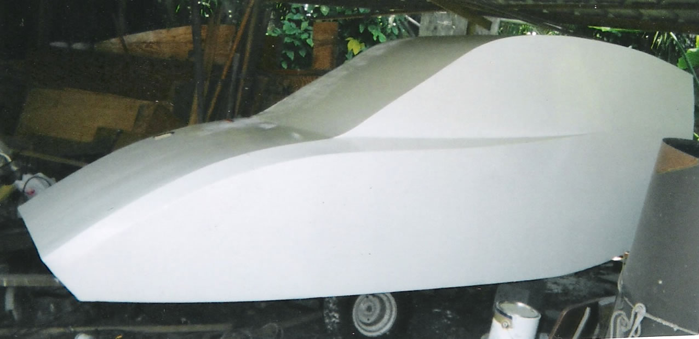   | 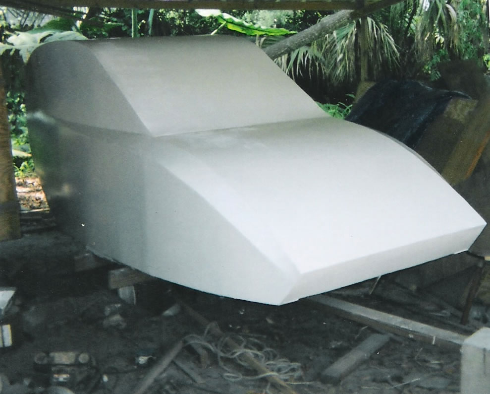 | 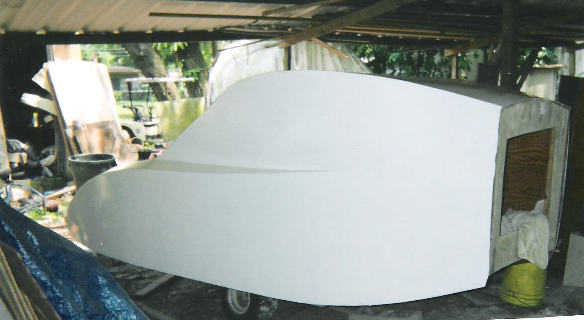 | 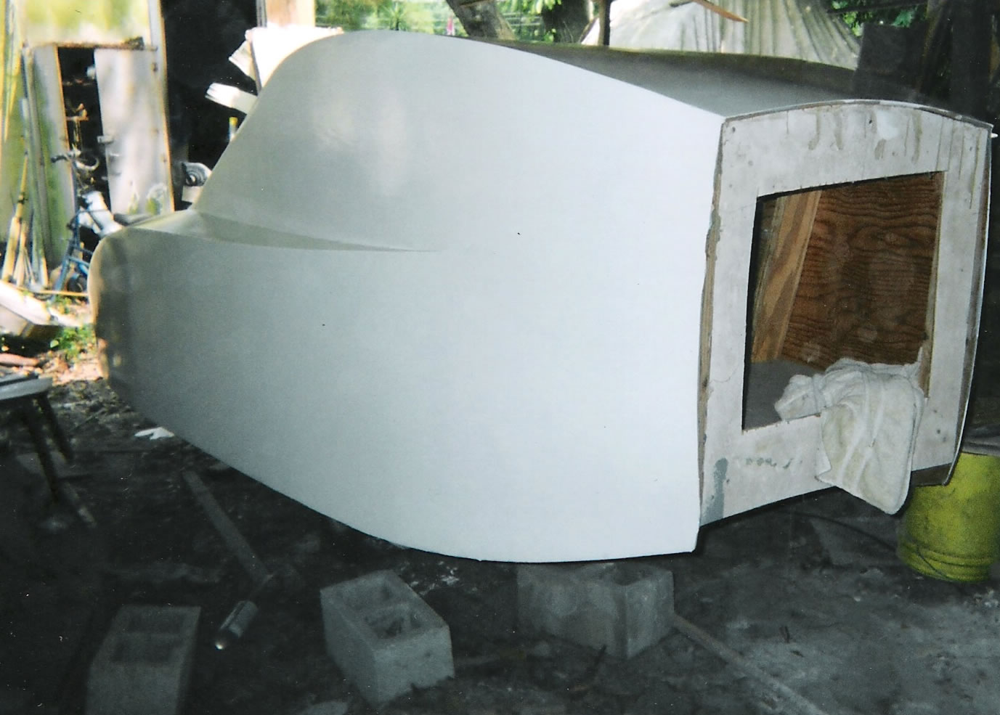 |
| 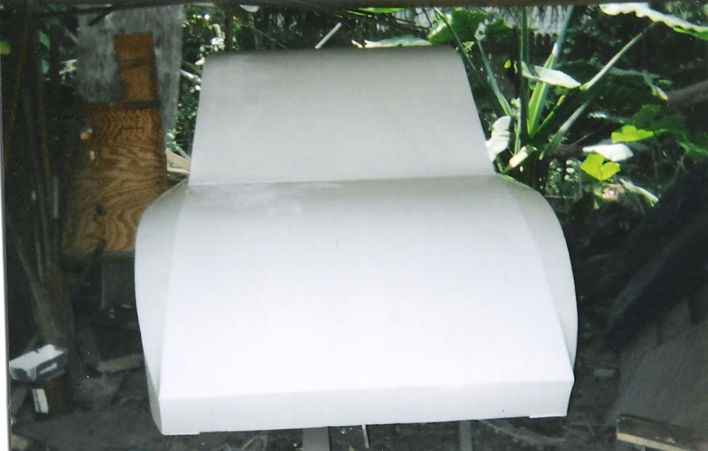 | 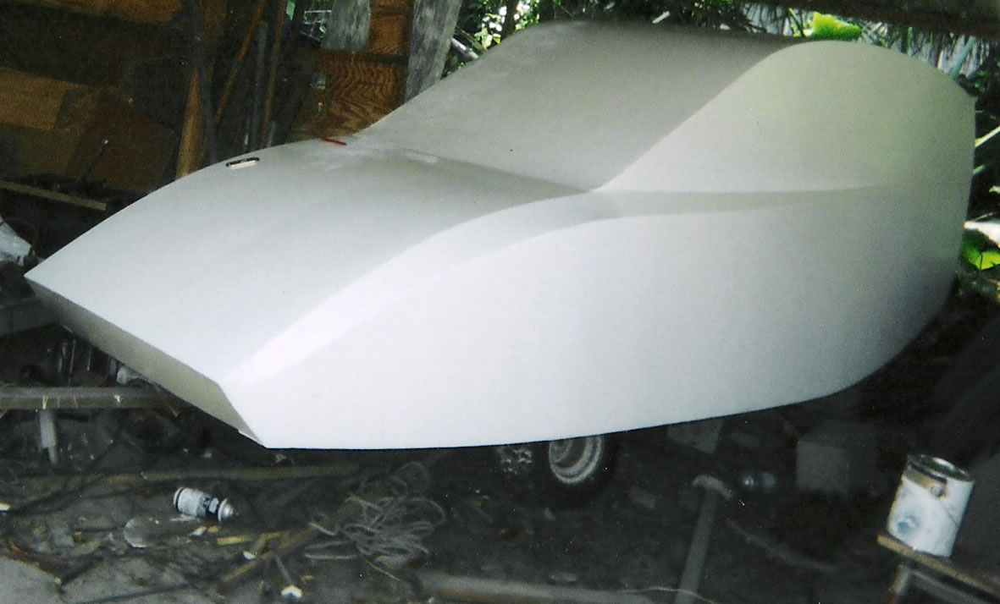 | 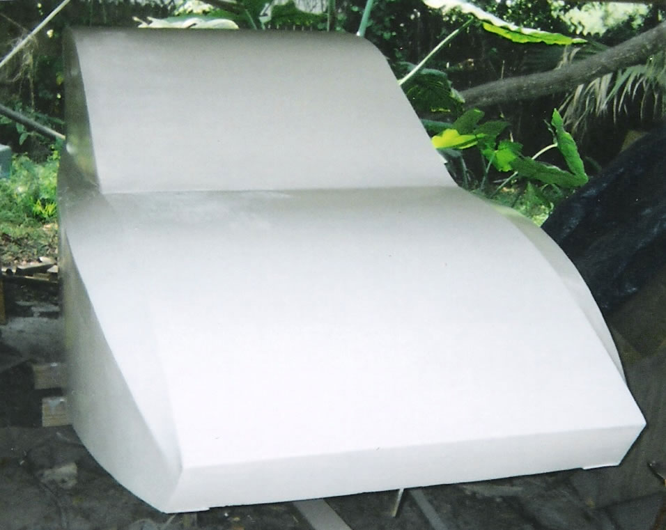 |                                              |

Female Mold
-----------

The inside of this will be used as a mold to put Freedom EV bodies into
production.

|                                                                                             |                                                                                                                                                      |                      |                                                 |
|---------------------------------------------------------------------------------------------|------------------------------------------------------------------------------------------------------------------------------------------------------|----------------------|-------------------------------------------------|
| 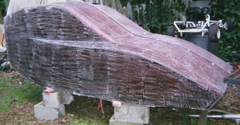 | 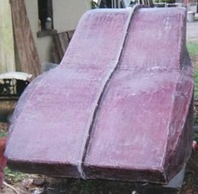 | 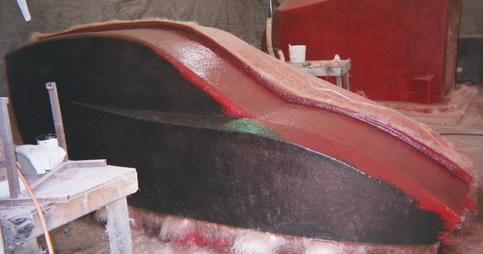 | 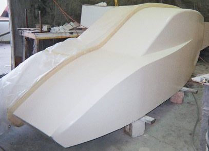 |
