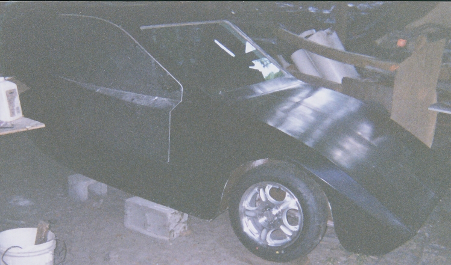
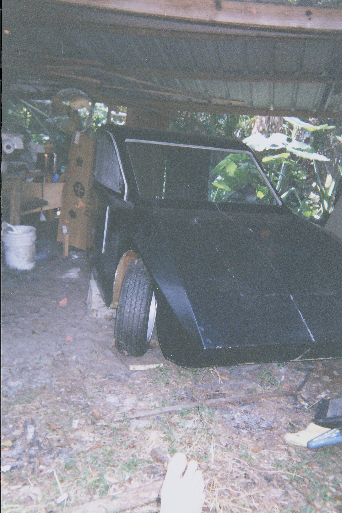
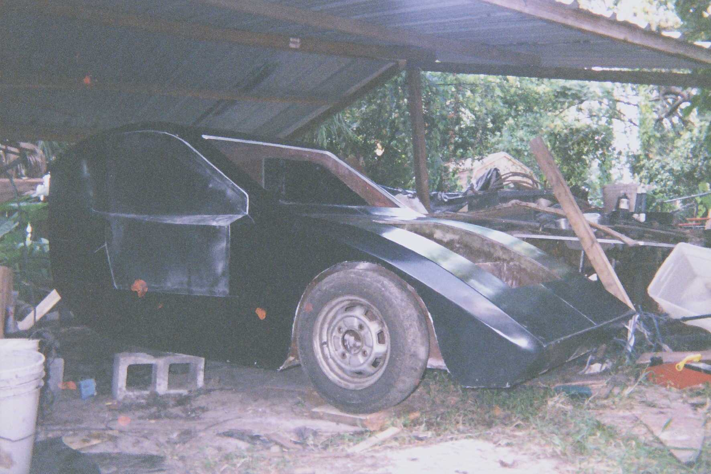

Male Mold
---------

The outside of the [Freedom EV](/wiki/Freedom_EV "wikilink") will look
something like this, but the door and window openings etc. are omitted.

|                                              |                                              |                                              |                                              |
|----------------------------------------------|----------------------------------------------|----------------------------------------------|----------------------------------------------|
|    |  |  |  |
|  |  |  |                                              |

Female Mold
-----------

The inside of this will be used as a mold to put Freedom EV bodies into
production.

|                                                                                             |                                                                                                                                                      |                      |                                                 |
|---------------------------------------------------------------------------------------------|------------------------------------------------------------------------------------------------------------------------------------------------------|----------------------|-------------------------------------------------|
|  |  |  |  |

First Real Body
---------------

It was made from the above mold.

|                                  |                                                                             |                                  |                                  |
|----------------------------------|-----------------------------------------------------------------------------|----------------------------------|----------------------------------|
|  |  |  |  |
