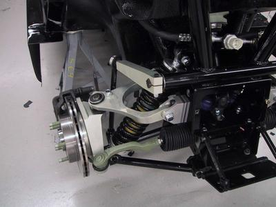

Design
------

-   here is a good summary page on
    [suspension](http://www.chris-longhurst.com/carbibles/index.html?menu.html&suspension_bible.html)
    types.
-   Sliding Pillar suspension: here is the [Morgan trike Sliding
    Pillar](http://morgan3w.de/technic/technic.htm) front suspension.
    Also a picture of the
    [locost7](http://locost7.info/files/suspension/Robin+Hood+Sliding+Pillar.jpg),
    front suspension. Locost7 is apparently a Lotus 7 home built.
-   [Modified McPherson Strut](http://www.rqriley.com/images/fig-15.gif)
    for 3 wheel Cars. From
    [Riley's](http://www.rqriley.com/suspensn.htm) "Automobile Ride,
    Handling, and Suspension Design".
-   Tango suspension from yahoo Tango-EV group

Parts sourcing ideas
--------------------
