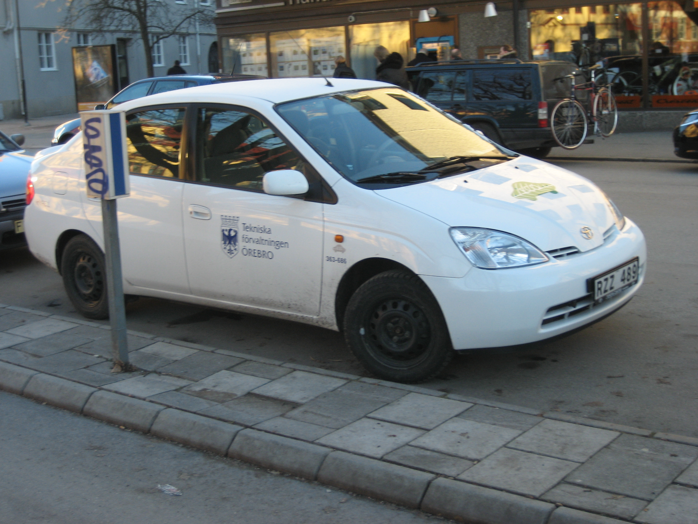

The **Toyota Prius** is the first mass-produced and marketed
[hybrid](/wiki/Petroleum_electric_hybrid_vehicle "wikilink") automobile/car.
In [Latin](/wiki/Latin "wikilink"), *prius* means "before." It went on sale in
[Japan](/wiki/Japan "wikilink") in 1997, and worldwide in 2001. By the end of
2003, nearly 160,000 units had been produced for sale in Japan,
[Europe](/wiki/Europe "wikilink"), and [North
America](/wiki/North_America "wikilink"). The Prius (2000 to 2003 model years)
is certified as a [Super Ultra Low Emission
Vehicle](/wiki/Super_Ultra_Low_Emission_Vehicle "wikilink") (SULEV) by the
[California Air Resources
Board](/wiki/California_Air_Resources_Board "wikilink") (CARB). With the 2004
model, the Prius was redesigned as a midsize
[hatchback](hatchback "wikilink") and certified as an Advanced
Technology [Partial zero-emissions
vehicle](/wiki/Partial_zero-emissions_vehicle "wikilink") (AT-PZEV). The 2000
model Prius slotted between the [Echo](/wiki/Toyota_Vitz "wikilink") and
[Corolla](/wiki/Toyota_Corolla "wikilink") in the company's North American
lineup. The 2004 model slots between the Corolla and
[Camry](/wiki/Toyota_Camry "wikilink").

The Prius has won numerous [awards](/wiki/Prius#Awards "wikilink") including
Car of the Year awards for Europe, Japan and North America. It is most
famous for its fuel economy. The U.S. EPA has rated the current version
at 60 [mpg](/wiki/Miles_per_gallon "wikilink") (3.9 [L/100
km](/wiki/L/100_km "wikilink")) city driving and 51 mpg (4.6 L/100 km)
highway, although real-world results tend to average in the mid 40s mpg
(about 5 L/100 km).

In the United States, the Prius initially attracted buyers interested in
the vehicle's low particulate emissions, advanced technology, and high
fuel economy. In 2006, demand for the Prius broadened for several
reasons: the rising price of gasoline made the vehicle's fuel economy
more attractive; tax credits provided by the federal government lowered
the end-price to consumers; and some states introduced privileges for
hybrid vehicle drivers. California, Maryland and Virginia, for example,
allowed single-occupant hybrid vehicles in
[HOV-lanes](/wiki/High-occupancy_vehicle_lane "wikilink").

How it works
------------

  
*Main article*: [Petroleum-electric hybrid vehicle
page](/wiki/Petroleum_electric_hybrid_vehicle "wikilink")

The Prius is a [series-parallel](/wiki/Hybrid_Vehicle_Drivetrains "wikilink")
configuration hybrid, a vehicle that can run on just the engine, just
the batteries, or a combination of both. [Toyota's](/wiki/Toyota "wikilink")
design goals are to reduce the amount of pollution and to maximize fuel
efficiency. To do this, it uses a gasoline/electric hybrid powertrain,
incorporating large batteries that are charged by the gas (petrol)
engine directly or by regenerative braking (cannot be plugged in as
built). Either the engine or the battery (or both) can power the
vehicle, depending on conditions. This gives it the acceleration and
power of a standard car having a much larger gasoline-burning engine.
Specifically, the Prius incorporates:

1.  More efficient use of the [internal combustion
    engine](internal_combustion_engine "wikilink") (ICE), reducing
    gasoline/petrol consumption. The [1NZ-FXE
    engine](/wiki/Toyota_NZ_engine "wikilink") uses the more efficient
    [Atkinson cycle](/wiki/Atkinson_cycle "wikilink") instead of the more
    common [Otto cycle](/wiki/Four-stroke_cycle "wikilink");
2.  Two [electric
    motor](electric_motor "wikilink")/[generators](electrical_generator "wikilink"),
    MG1 and MG2 are in the transaxle. The MG2 provides 50 kW (67 hp) @
    1,200 to 1,540 rpm and 400 N·m (295 ft·lbf) torque from 0 to 1,200
    rpm, which significantly contributes to performance and economy. The
    MG1, with rpm from -10,000 to +10,000 rpm, provides the engine
    starter and counter torque for the electronic Continuously Variable
    Transmission;
3.  50 kW [IGBT](/wiki/IGBT "wikilink")
    [inverter](inverter_(electrical) "wikilink") controlled by a 32-bit
    [microprocessor](microprocessor "wikilink"), which efficiently
    converts power between the batteries and the motor/generators.
4.  Lower [coefficient of drag](/wiki/Drag_coefficient "wikilink") at 0.26
    (0.29 for 2000 model), with a [Kammback](/wiki/Kammback "wikilink") design
    reducing air resistance, especially at higher speeds;
5.  Lower rolling-resistance tires on the 2000 model, reducing road
    [friction](friction "wikilink");
6.  [Regenerative braking](/wiki/Regenerative_braking "wikilink"), a process
    for recovering [kinetic energy](kinetic_energy "wikilink") when
    braking or travelling down a slope and storing it as [chemical
    potential energy](chemical_potential_energy "wikilink") in the
    [traction
    battery](/wiki/Battery_(electricity)#Traction_batteries "wikilink") for
    later use while reducing wear and tear on the brake pads;
7.  Sealed 168-cell [nickel metal
    hydride](nickel_metal_hydride "wikilink") (NiMH)
    [battery](rechargeable_battery "wikilink") providing 201.6 volts;
8.  [Continuously variable
    transmission](/wiki/Continuously_variable_transmission "wikilink") — the
    Prius uses a computer-managed (rather than a mechanical) CVT; Toyota
    calls it the Power Split Device[1]. The electric motors and gasoline
    engine are connected to a [planetary
    gear](planetary_gear "wikilink") set which is always engaged, and
    there is no shifting.
9.  Flexible resin gasoline tank, reducing the amount of
    [hydrocarbon](hydrocarbon "wikilink") emissions in the form of
    escaped gasoline vapour; (US model only)
10. [Vacuum flask](/wiki/Vacuum_flask "wikilink") coolant storage system that
    stores hot engine coolant when the vehicle is powered off, then
    reuses it to reduce warm-up time. (US model only)
11. [EV Mode](/wiki/Toyota_Prius#EV_Mode "wikilink") (Europe and Asian markets
    only, aftermarket option in the U.S.) allows the driver to select
    electric-only mode in low-power conditions. The vehicle can only be
    driven a couple kilometers (depending on conditions) on battery
    power alone before the gas engine is needed.
12. Weight reduction — for example the hatch and hood/bonnet are made of
    [aluminium](aluminium "wikilink") instead of
    [steel](steel "wikilink").

One reason that the Prius gets such good gasoline mileage is that the
[ICE](/wiki/Internal_combustion_engine "wikilink") is smaller than in most
cars this size. The ICE usually shuts off at stop lights and when
backing up and descending long hills. The Prius performance remains very
good because the battery/electric motor booster automatically provides
more than enough extra power for acceleration and hill climbing. This
means it drives like a traditional ICE automobile, with the on-board
computer taking care of shifting power to and from the engine and
motors, and automatically determining when to charge the battery, as
well as the most efficient use of the engine or the electric motors (or
both) based on driving conditions. This also means that one cannot use
electricity from external sources. Advocates of 'plug-in' hybrids
consider this to be a missed opportunity. The Prius also uses its
electric motor to recharge the battery during braking, with kinetic
energy normally wasted as heat being recaptured. This also significantly
reduces brake wear.

The engine can shut down once it has warmed up and the [catalytic
converter](catalytic_converter "wikilink") in the exhaust system has
reached operating temperature. The Prius can then operate solely on
electric power under low energy loads. This is sometimes referred to as
"stealth mode" due to the lack of engine noise. This further reduces
gasoline consumption and engine wear. When driving conditions demand
additional power, the engine starts up automatically. 

The on-board computer ensures that the engine runs under the most
efficient conditions. Typically, a petrol/gasoline engine runs
inefficiently at half-throttle, creating a choking condition. This
effect, called [pumping loss](pumping_loss "wikilink"), is a major
reason for the inefficiency of gasoline engines compared to
[diesels](diesel_engines "wikilink"). The Prius minimizes pumping loss
by running the gasoline engine at a high torque range with the throttle
fully open. [Drive-by-wire](/wiki/Drive-by-wire "wikilink") throttle control
technology and Toyota's *Hybrid Synergy Drive* (a torque combiner,
electric drive, and computer control) are essential to this engine
control. , showing energy flow to/from the engine, battery, and from the regenerative braking, as well as battery charge level.")

In addition to the immediate benefit of reducing fuel consumption and
emissions, stopping the combustion engine also improves the performance
of the catalytic converter. In a non-hybrid vehicle the exhaust gases
from an idling engine tend to cool the catalysts below their optimal
temperature. 
The frequent starting and stopping of the engine does not cause
additional wear and tear or emission problems because the drive motors
have enough power to quickly spin the engine to optimal
[rpm](/wiki/Revolutions_per_minute "wikilink") (around 1,000) before the
engine fires up. This avoids the wear that would occur if the engine
were to run (with fuel and spark) at very low rpm.

](PriusPowerSteering.jpg "fig:Electric power steering")
") For any
car, [aerodynamic](aerodynamic "wikilink") losses due to
[drag](/wiki/Drag_(physics) "wikilink") are much greater on the highway than
in low speed city driving. A non-hybrid car nonetheless gets worse
mileage in city driving because its engine is far less efficient at low
power, such as when stopped in traffic, and because it must frequently
dump its kinetic energy into the brakes during stop-and-go driving. The
Prius gets better fuel efficiency in city
[dynamometer](dynamometer "wikilink") cycles because the engine can shut
down instead of running at low power, and run solely off the battery at
low speeds and when stopped (including the cabin air heating/cooling
system and the power steering). Also, the car's kinetic energy is
captured when braking and stored in the battery. According to
[EPA](/wiki/Environmental_Protection_Agency "wikilink") tests [2], the Prius
gets 60 mpg (3.9 L/100 km) in the city dynamometer tests, compared with
51 (4.6 l/100 km) on the highway, and [Natural Resources
Canada](/wiki/Natural_Resources_Canada "wikilink") estimates 58.8 mpg (4.0
l/100 km) in the city and 56.0 (4.2 l/100 km) on the highway. (Owing to
peculiarities of these tests, few drivers obtain these mileage values in
typical suburban circumstances, but "real world" performance with
careful driving can come close. Typical real-world drivers get about
46-50 mpg or 5.1 to 4.7 L/100 km, [hypermilers](hypermiler "wikilink")
can get up 100 mpg (42.5 km/L). This means the greatest advantages of a
hybrid are mainly in city driving, though factors including driving
style, air conditioning use, and short trips may offset some of this
advantage. The hybrid has less of an advantage in higher speed open road
driving typical of intercity driving, yet obtains improved mileage under
these circumstances since it can use a smaller and more efficient engine
than would otherwise be required (because the battery and electric motor
can provide the extra peak power needed for passing and limited hill
climbing).

Versions
--------

The first Prius model, NHW10, was sold only in Japan, though [personal
imports](grey_import "wikilink") have been made to the British Isles,
Australia, and New Zealand. Subsequent versions have seen wider sales,
increased power and reduced battery weight.

<table>
<thead>
<tr class="header">
<th>
Feature
</th>
<th>
Model code
</th>
</tr>
</thead>
<tbody>
<tr class="odd">
<td>
NHW10
</td>
<td>
NHW11
</td>
</tr>
<tr class="even">
<td>
Body style
</td>
<td>
4 Door 
Sedan
</td>
</tr>
<tr class="odd">
<td>
First sales
</td>
<td>
1997
</td>
</tr>
<tr class="even">
<td>
Battery
</td>
<td>
Modules
</td>
</tr>
<tr class="odd">
<td>
Cells per module
</td>
<td>
6
</td>
</tr>
<tr class="even">
<td>
Total cells
</td>
<td>
240
</td>
</tr>
<tr class="odd">
<td>
Volts per cell
</td>
<td>
1.2
</td>
</tr>
<tr class="even">
<td>
Total volts (nominal)
</td>
<td>
288
</td>
</tr>
<tr class="odd">
<td>
Capacity amp hours
</td>
<td>
6.0
</td>
</tr>
<tr class="even">
<td>
Capacity Watt hours
</td>
<td>
1728
</td>
</tr>
<tr class="odd">
<td>
Weight kg
</td>
<td>
57
</td>
</tr>
<tr class="even">
<td>
Petrol Engine
</td>
<td>
Power kW
</td>
</tr>
<tr class="odd">
<td>
Max rpm
</td>
<td>
4000
</td>
</tr>
<tr class="even">
<td>
Electric Motor
</td>
<td>
Operating Voltage
</td>
</tr>
<tr class="odd">
<td>
Power kW
</td>
<td>
30
</td>
</tr>
<tr class="even">
<td>
Combined
</td>
<td>
Power kW
</td>
</tr>
</tbody>
</table>

Production of the Prius for the [China](/wiki/China "wikilink") market began
in December 2005 by [Sichuan FAW Toyota
Motor](/wiki/Sichuan_FAW_Toyota_Motor "wikilink"), a [joint
venture](joint_venture "wikilink") with [First Automobile
Works](/wiki/First_Automobile_Works "wikilink").

### 2001 to 2003 Prius (NHW11)

The first Prius sold in the U.S. was a compact sedan with a distinctive
front hood (bonnet). Sold in relatively small numbers, it nevertheless
gained wide attention and proved the market existed for a sensible
hybrid vehicle as a family car.

### 2004 to 2007 Prius (NHW20)

The Prius 2004 model was a complete redesign of the previous generations
of Prius. The new model is larger inside and out (now a mid-size
vehicle), gets even better gas mileage and is a hatchback. It is based
on the new (second generation) [Hybrid Synergy
Drive](/wiki/Hybrid_Synergy_Drive "wikilink") (HSD or also known as THSII),
replacing the earlier [Toyota Hybrid
System](/wiki/Toyota_Hybrid_System "wikilink") (THS) technology. The first
generation (1997 to 2003) used the engine to run the air conditioning
compressor. While idling, the engine would need to start every minute or
so if the air conditioning was running. In contrast, the 2004 model
introduced an all-electric compressor for cooling. This not only allowed
the use of air conditioning without the engine starting from time to
time when the car was completely still, it also allowed more extensive
use of the "stealth mode" (operation on electric motor only).

Its [drag coefficient](drag_coefficient "wikilink") of 0.26 was then the
second-lowest in the industry, after the [Honda
Insight](/wiki/Honda_Insight "wikilink") at 0.25.

Regenerative braking was greatly improved, relying so little upon the
friction-type brakes (except for panic stops) that some Toyota
technicians quipped that the original brake pads might well last for the
life of the car.

The 2004 Prius emerged as a midsize car with more room than the previous
compact, redesigned as a "five-door" model (four doors plus a rear
hatch). In general, the car remained conveniently narrow on the outside,
rather flat-sided, and relatively tall (several inches taller than a
[Camry](/wiki/Toyota_Camry "wikilink")). The profile was more continuous, with
a short sloping nose transitioning to a highly sloped windscreen and an
arcing roofline ending in a cut-off [Kammback](/wiki/Kammback "wikilink"). The
additional height allowed a more erect seating position and a higher eye
point, giving a better view of the road to the driver. There was also a
surprising amount of additional rear-seat leg room, resembling that
available in a much larger vehicle. Fold down rear seats with a 60/40
split made for easy carriage of most parcels. It retains a tight turning
radius of 17 feet (34 feet or 10.4 meters in diameter), which when
combined with a short hood is particularly useful in urban environments.

With a smaller and lower voltage NiMH battery and a [boost
converter](boost_converter "wikilink") to step the voltage up to 500 V,
the 2004 model was more powerful (2 seconds faster in 0 to 96 km/h
acceleration) and is 15% more [fuel
efficient](fuel_efficiency "wikilink") than the previous generation
Prius, with 60 miles per US gallon (25.5 km/L) city and 51 miles per US
gallon (22 km/L) highway (according to the
[EPA](/wiki/Environmental_Protection_Agency "wikilink")) [3]. Except in short
trips or extreme cold, typical commuting and mixed suburban drivers are
reporting fuel consumption of 45 to 50 miles per US gallon (19-21 km/L).
[4] Models have a 0-60 mph acceleration time of 10.1 seconds and a top
speed of 105 mph (169 km/h) when using both electric and internal
combustion motors simultaneously. When exclusively using its electric
motor, the Prius has a 42 mph (68 km/h) top speed.

The multi-function-display (MFD) shows fuel consumption bars for each
five minute segment of driving and this can encourage economical
driving. The display also indicates instantaneous fuel consumption,
which is useful for detecting when the vehicle has switched from
electric-only to electric plus ICE. At this time it can usually be
advantageous to accelerate quickly rather than lug the vehicle, in an
attempt to get to a more favorable location or speed range for
electric-only mode.

An option called the Smart Key System (SKS) eliminates the traditional
ignition key. The "smart key," which resembles a conventional keyless
entry remote, has buttons to remotely lock and unlock the door, as well
as trigger the alarm system. It is not necessary to use any of the
buttons to utilize the SKS. Approaching to within one meter of the car
while in possession of the key (even inside a pocket or purse) causes
the interior dome lights to fade in (if the switches are at the DOOR
position). When the person with the key in their possession touches the
inside of either of the front door handles, or the rear hatchback door
handle, that door (or more) is immediately unlocked and can be opened.
There are three settings in which the Smart Key System (SKS) can
operate: driver's door unlocking mode, single door unlocking mode, and
all doors unlocking mode. Once inside, the car may be started by pushing
the "POWER" button while depressing the brake pedal, with the fob still
safely tucked away inside your pocket or purse. To stop the car, push
the "POWER" button again. Once parked, the car can be locked by a
pushing a black button on the exterior door handle. The SKS will detect
keys left inside the vehicle when powered-off, and will not allow the
vehicle to be locked in this situation.

On cars which are not equipped with SKS, the driver uses the lock/unlock
buttons on the fob, and puts the remote fob into a slot in the dash to
allow the car to start.

The vehicle is classified as a [SULEV](/wiki/SULEV "wikilink") (Super Ultra
Low Emissions Vehicle), 90% cleaner than conventional gasoline-only
automobiles. It comes with an Advanced Technology Partial Zero Emission
Vehicle (AT-[PZEV](/wiki/PZEV "wikilink")) certification by the California Air
Resources Board ([CARB](/wiki/CARB "wikilink")).

As an interesting side note, an option package offered in Japan and
Europe gives the Prius the ability to perform parallel and reverse
parking assisted by the on-board computer — the first time such a
capability has been offered on a production vehicle. Eighty percent of
the Prius buyers in Japan have chosen this option. The system is not
[intelligent](/wiki/Artificial_Intelligence "wikilink") though, particularly
lacking [machine vision](machine_vision "wikilink") which would allow
avoidance of obstructions or pedestrians, so it is very limited. [5]

The Prius also has an optional [Bluetooth](/wiki/Bluetooth "wikilink") hands
free kit for [cellphones](cellphone "wikilink"), which uses one of the
stereo's speakers in the driver door, and a microphone near the
rear-view mirror. The steering wheel has a dedicated button for
answering and hanging up the phone while driving. The hands free system
usually comes in the highest or next-to-highest packages from the
dealership. Most, but not all Bluetooth phones are 100% compatible with
the Prius. Nearly all phones have the minimum functionality of using the
car as a headset, but some phones also allow some or all of the
following actions:

-   Copy phone numbers to the Prius' (small) internal phone book (some
    allow them to be sent all at once).
-   Display cell tower signal strength on any cellphone related screen.
-   Cell phone ring tone heard through the car audio system.
-   Voice dialing through car audio system.

The 2006 Prius introduced some minor cosmetic changes, along with
optional features such as advanced airbags, a rear-view camera, an
upgraded audio system (including a line-in port), an updated Navigation
DVD with new user interface, and a higher-resolution [liquid crystal
display](liquid_crystal_display "wikilink").

The 2007 Prius carries over the newer features from 2006 (also slightly
higher price), while making the advanced and side-curtain airbags
standard on all models. Also available is a Touring Edition that
includes an elongated larger rear spoiler as well as larger,
sharper-pointed 7-spoke 16" alloy wheels with plastic hub cap cover to
protect it from scratches when parking against the curb. In addition,
the Touring Edition also comes with a firmer European tuned suspension,
standard high-intensity-discharge (HID) headlights and integrated
(non-HID) fog lights.

### 2009 Prius

The Prius is scheduled for a redesign for the 2009 model with a
significant number of upgrades. It has been mentioned that the new Prius
will receive an upgrade of the petrol (gasoline) engine from 1.5 litres
to 1.8 litres. The upgraded specifications of the vehicle will give it
vastly improved mileage rumoured to be between 80–113 MPG (2–3 L/100 km)
as well as improved acceleration giving it a sprint time of less than 10
seconds in 0–100 km/h (0–62 mph). It has been rumored that the new
Prius's range will exceed 1000 miles (1600 km) on a full tank. [6]

The [third generation Hybrid Synergy
Drive](/wiki/Hybrid_Synergy_Drive#Third_generation "wikilink") from Toyota is
expected to debut in the 2009 Toyota Prius, due out in late 2008 or
early 2009. It will use [lithium-ion
batteries](lithium-ion_batteries "wikilink") for greater energy density,
resulting in better performance and less weight. It should also give the
new Prius more cabin or trunk space.

Toyota CEO [Katsuaki Watanabe](/wiki/Katsuaki_Watanabe "wikilink") confirmed
this in an interview with [BusinessWeek](/wiki/BusinessWeek "wikilink") on
February 16, 2007. "We are now aiming at reducing, by half, both size
and cost of the third-generation hybrid system," said Watanabe. [7]

Crash testing
-------------

NHTSA crash testing of the 2004 Prius yielded a five star driver and
four star passenger rating in the frontal collision test (out of five
stars). Side crash results were four out of five stars for both front
and rear seats. The car scored four out of five stars in rollover
testing. [8]

In 2004, [EuroNCAP](/wiki/EuroNCAP "wikilink") tested the Prius. It earned
these ratings:

-   Adult Occupant Rating-
-   Child Occupant Rating-
-   Pedestrian Rating-

Awards
------

-   1997–98 Car of the Year Japan[9]
-   2003 *[Scientific American](/wiki/Scientific_American "wikilink")* names
    [Toyota Motor Corporation](/wiki/Toyota_Motor_Corporation "wikilink") as
    "Business Leader of the Year" ("Scientific American 50";
    December, 2003) for its singular accomplishment in the
    commercialization of affordable hybrid cars.
-   *[Motor Trend](/wiki/Motor_Trend "wikilink")* [Car of the
    Year](/wiki/Motor_Trend_Car_of_the_Year "wikilink") 2004 (January 2004
    issue)
-   *[Car and Driver](/wiki/Car_and_Driver "wikilink")* magazine's [Ten Best
    list](/wiki/Car_and_Driver_Ten_Best "wikilink") for 2004.
-   [North American Car of the
    Year](/wiki/North_American_Car_of_the_Year "wikilink") award for 2004.
    Nominated in 2001.
-   [International Engine of the
    Year](/wiki/International_Engine_of_the_Year "wikilink") for 2004.
-   "Best Engineered Vehicle for 2004" by
    [SAE](/wiki/Society_of_Automotive_Engineers "wikilink")'s *Automotive
    Engineering International* magazine.[10]
-   2005 [European Car of the Year](/wiki/European_Car_of_the_Year "wikilink")
    (406 points, ahead of [Citroën C4](/wiki/Citroën_C4 "wikilink") with 267
    points and [Ford Focus II](/wiki/Ford_Focus "wikilink") with 228).[11]
-   2006 EnerGuide Award (Midsize)[12]
-   2006 Intellichoice Best Overall Value of the Year, Midsize [13]
-   2007 Intellichoice Best in Class Winner :Best Retained Value, Lowest
    Fuel, Lowest Operating Costs, Lowest Ownership Costs[14]

Aftermarket products
--------------------

### EV mode

When the vehicle is turned-on with the "start" button, it is ready to
drive immediately with the electric motor, while electric pumps warm the
engine with previously saved hot engine coolant, before the internal
combustion engine is started. The delay between starting the car and
starting the internal combustion engine is approximately seven seconds.
The Asian and European versions of this vehicle provide a button
labelled "EV" that maintains Electric Vehicle mode after start up, under
most low-load driving conditions. The North American model does not have
the "EV" button, although the "EV" mode is still supported internally by
the Prius Hybrid Vehicle management computer. While some have speculated
that EV mode was not included on North American models in the interest
of retaining the longer warranted battery life of 150,000 miles (240,000
km) in certain US states, a Toyota chief engineer has stated that the EV
button was omitted because its use can cause the [catalytic
converter](catalytic_converter "wikilink") to cool too much, leading to
emissions problems[15]. In addition to information from on-line
discussion groups, the PRIUS+ Project[16] offers instructions for
*[do-it-yourselfers](/wiki/Do_it_yourself "wikilink")* who wish to enable the
button.

### Plug-in

Plug-in hybrids use a larger battery pack that is recharged from
external sources in order to further reduce gas consumption. The
batteries in a production PHEV will be built to handle deeper discharge
cycles without loss of lifespan such as those in the [Toyota RAV4
EV](/wiki/Toyota_RAV4_EV "wikilink"). Operation of the vehicle will be very
similar to a normal hybrid, other than the electric operation will be
more prevalent. In the case of a Prius PHEV, under high-load situations
such as high-speed roads, the gasoline (petrol) engine will operate as
before, leaving the car the same ability to accelerate and use freeways.
Current converted Prius also operate in a high speed [blended
mode](blended_mode "wikilink") which can reduce but not eliminate
gasoline consumption on the freeway. When driving in slower conditions
or other light loads, the batteries will be used first in a
[charge-depleting](charge-depleting "wikilink") mode, allowing moderate
commutes at low speeds (particularly under 41 mph/65 km/h) to be driven
entirely on electricity. Once the batteries have been sufficiently
discharged the car will automatically revert back to the
[charge-sustaining](charge-sustaining "wikilink") mode of the current
stock Prius. Safe lithium-based batteries exist, eliminating all risk of
run-away thermal conditions (spontaneously catch fire or explode) as
seen in some laptop computer batteries.

Evolving from the button project, The California Cars Initiative
(CalCars)[17] converted a Prius in 2004, adding larger batteries and
found out how to safely charge the batteries without affecting the
hybrid system. Private companies EDrive Systems in the
[USA](/wiki/United_States "wikilink") and Amberjac Projects in the
[UK](/wiki/United_Kingdom "wikilink") announced plans to sell conversion kits
in 2006 (pushed back to 2007). The most recent versions use a new,
patented advanced safe-format Lithium Battery from Valence Technology
called Saphion. Using the advanced batteries pushes the final price to
an estimated $12,000 US. The energy density and far more efficient
utilisation of these batteries provide around 20x the available power of
the standard NiMH battery pack but at only double the weight. Tests show
it capable of achieving &gt;30 miles (50 km) in all electric mode at
speeds below 34 mph (55 km/h). The internal combustion engine starts
only at higher speeds or when extra acceleration is needed. Fuel economy
is improved to 50-200 km/L (100-500 mpg (US)) [18] depending on driving
conditions. City driving may be possible without using the ICE at all,
eliminating the use of almost all liquid fuel in exchange for electrical
energy.

PriusPlus[19] is a similar project evolving from CalCars, using
lead-acid batteries and a do-it-yourself kit. This conversion gives a
car that has 100 mpg under normal driving conditions. All-electric mode
can be used for 10-12 miles in street driving. In January 2007 issue of
[IEEE Spectrum](/wiki/IEEE_Spectrum "wikilink"), CalCars lead technical
engineer, Ron Gremban, notes that drivers installing the CalCars Prius+
kit shouldn’t expect a 'positive financial payback.'[20] In addition,
the kit adds 135 kg to the car's weight, reducing fuel economy over the
stock Prius whenever the gasoline engine is used exclusively. The
battery pack suffers in cold weather, has a limited life of about 400
deep discharges, and must be recharged within a day to maintain this
lifespan. The hope is, by the time the batteries need replacing, a
better option is on the market at a comparable price.

Hymotion[21] is a Canadian company (recently purchased by A123systems,
an advanced battery company) planning on selling a kit incorporating
Lithium-Ion batteries with similar characteristics as EDrive Systems. It
is currently undergoing fleet testing, and is planned for sale for 2008.

Recently Toyota has announced that it intends to build a plug in hybrid
vehicle at an unspecified future time. [22]

### Solar panels

Solar panels provide additional energy to the batteries while the
vehicle is in motion or otherwise away from the grid. Solar panels are
also useful when the Prius is parked for extended periods of time in a
sunny location if it doesn't have a charger or is not connected to a
power outlet. Some drivers have claimed up to 30% mileage improvements
with the addition of their solar panels, although individual results are
dependent on the size and efficiency of the solar panels as well as
weather conditions. Drivers in Australia and the US south western
states, for instance, see the largest mileage improvements on their
Prius. One advantage of solar panels is that they do not wear out or
depreciate like ICE components. [23]

Notable facts
-------------

### Name

The word **prius** has been said to be
[Latin](/wiki/Latin_language "wikilink") meaning "to go before". In fact it is
a Latin [comparative](comparative "wikilink")
[adjective](adjective "wikilink"), not a Latin [verb](verb "wikilink").
It is the [neuter](neuter "wikilink")
[nominative](nominative "wikilink") singular form of the adjective whose
corresponding masculine and feminine nominative singular forms are
**prior**. [1](http://pt.wiktionary.org/wiki/prior)

### Recalls

-   In July 2006 Toyota issued a recall totaling 34,700 units covering
    early model Prius and Echo cars (26,200 Echo and 8,500 Prius). This
    recall was not related to hybrid components of the car. The
    connector for the crankshaft position sensor may become
    disconnected.[24]
-   In May 2006, Toyota announced the
    [recall](product_recall "wikilink") of up to 170,856 Prius vehicles
    because of a crack which can develop in the steering shaft if the
    Prius is frequently steered at full lock, or if the front tires
    strike the curb. The fault can affect Priuses made in 2004 through
    to November 2005.[25][26]
-   On [June 1](/wiki/June_1 "wikilink"), [2005](2005 "wikilink"), the
    National Highway Traffic Safety Administration of the US started an
    investigation on the 33 reported cases of engine stalling when the
    Prius travels at highway speed. The cars were still operable under
    battery power for a short distance with substantial loss of power
    when the internal combustion engine failed to run. Toyota believes
    it was due to a computer programming error that was fixed in a
    recall (SSC-40D) issued back in September, 2004. The investigation
    needs to verify if all the valid reported cases occurred to cars
    that did not receive the software fix.
-   In August 2004, Toyota began a Special Service Campaign (SSC 40G),
    affecting most previous-generation Prius cars manufactured between
    2001 and mid-2003. This repair involves re-sealing terminals on the
    high-voltage battery to avoid minor
    [electrolyte](electrolyte "wikilink") leakage. Repairs will be
    performed free of charge on affected automobiles.

### Local incentives

-   In the US, the Internal Revenue Service approved a series of tax
    deductions and credits through at least [September
    30](/wiki/September_30 "wikilink"), [2006](2006 "wikilink").[27] This
    amounts to $3150 tax credit for cars purchased between [January
    1](/wiki/January_1 "wikilink") [2006](2006 "wikilink") and [September
    30](/wiki/September_30 "wikilink") [2006](2006 "wikilink"). Thereafter the
    credit dropped to half until an anticipated date of [March
    31](/wiki/March_31 "wikilink") [2007](2007 "wikilink"), whereafter it will
    be $787.50 before disappearing entirely under current tax law on
    [October 1](/wiki/October_1 "wikilink") [2007](2007 "wikilink").
-   Some companies such as [Hyperion
    Solutions](/wiki/Hyperion_Solutions "wikilink"),[28] [Bank of
    America](/wiki/Bank_of_America "wikilink") and [Google](Google "wikilink")
    give their employee incentives to purchase hybrid vehicles.
    Employees of Hyperion Solutions and Google can get a $5000 credit
    toward their purchase of a hybrid vehicle such as the Prius.
-   Drivers of the Toyota Prius, or other hybrid engine automobiles are
    allowed to drive by themselves in Carpool ([High Occupancy
    Vehicle](/wiki/High-occupancy_vehicle_lane "wikilink")) lanes in some US
    states such as Virginia (currently until [July
    1](/wiki/July_1 "wikilink"), [2007](2007 "wikilink"), and requires a
    special "Clean Fuel Vehicle" [licence
    plate](/wiki/Vehicle_registration_plate "wikilink") at $25 per year[29]),
    California (currently until [January 1](/wiki/January_1 "wikilink"),
    [2011](2011 "wikilink"),[30] requires $8 one-time fee for a decal),
    Florida (requires $5 per year decal), New York and Arizona.[31]
-   Prius drivers in London, UK, are exempt from the £8 daily
    [congestion charge](/wiki/London_congestion_charge "wikilink") (requires
    £10 per year registration).
-   Prius drivers in Winchester, UK, used to qualify for free parking at
    a number of the city's car parks (season ticket worth \~ £800 per
    annum). This has now been discontinued due to lack of funding.
-   Prius and other hybrid drivers purchasing a new hybrid in San Jose,
    California qualify for free parking city wide until [July
    1](/wiki/July_1 "wikilink") [2007](2007 "wikilink").[32]
-   Prius and other hybrid drivers qualify for free parking in metered
    spaces in the City of Los Angeles, California until [December
    31](/wiki/December_31 "wikilink") [2007](2007 "wikilink").[33]

### Miscellaneous news

-   The Wall Street Journal reported in 2007 that some blind people find
    the silence of the cars like the Prius to be a challenge in crossing
    the street. [34]
-   Due to the success of both the engineering and sales of the Prius,
    in 2005, Toyota has released a hybrid V-6 engine for the Lexus
    RX400h and a hybrid engine version of the Highlander. In 2006
    Toyota's \#1 selling car, the Camry added a hybrid version to the
    line-up.
-   Starting with the 2004 model, Toyota is now producing the Prius on a
    standard mass-production [assembly line](assembly_line "wikilink"),
    resulting in one being produced every minute instead of one every 8
    to 10 minutes. The use of a standard assembly line has dropped the
    manufacturing cost significantly, allowing Toyota to deliver a
    substantially upgraded model, which in turn has generated publicity
    and popularity. The limiting factor in Prius (and Lexus RX400h)
    production now appears to be third-party component availability,
    particularly batteries.
-   The battery pack of the 2004 Prius is warranteed for 160,000 km
    (100,000 miles) or 8 years, although Toyota has stated that they
    expect it to last 15 years. The warranty is extended to 240,000 km
    (150,000 miles) or 10 years for Prius in California and several
    other states that adopted the [Californian emission control
    standards](/wiki/California_Air_Resources_Board "wikilink").
-   In June 2002 the Prius became the first ever hybrid car to complete
    a [FIA](/wiki/Fédération_Internationale_de_l'Automobile "wikilink") rally.
    Driven by UK journalist Nik Berg and co-driver Tim Bampton, the
    Prius finished the 2002 Midnight Sun to Red Sea Marathon in 15th
    place after completing 8,000 km (5,000 miles) in 20 days of
    [rallying](rallying "wikilink").
-   The NHW20 Prius fuel tank holds 45 litres (11.9 US gal), although
    the internal bladder in American models limits the fill
    (particularly in colder weather), giving a range of up to 1,000 km
    (600 miles) under good conditions. The fuel tank capacity for a
    European NHW11 without the bladder is 50 litres.
-   In March 2007, an editorial in the [Central Connecticut State
    University](/wiki/Central_Connecticut_State_University "wikilink")
    *Recorder* alleged that the total cost and environmental damage to
    produce a Prius greatly outweighs that of producing a non-hybrid
    vehicle[35]. According to this editorial, over the lifespan of the
    vehicle, the Prius will cost more to operate than most other
    vehicles, and cost more energy initially for production of the
    batteries and other equipment. To truly be efficient, one would be
    more effective in purchasing a Toyota Scion xB, which costs a paltry
    $0.48 per mile to operate, as opposed to the $3.25 of the Prius.
    This editorial cited a study by [CNW Marketing Research,
    Inc.](/wiki/CNW_Marketing_Research,_Inc. "wikilink")[36], and was cited by
    a number of news
    sources[2](http://www.evworld.com/news.cfm?newsid=14582). However,
    in a letter to the editor of the Washington Post, a Toyota Motor
    Sales vice president refuted the CNW Marketing
    study[3](http://www.washingtonpost.com/wp-dyn/content/article/2007/04/25/AR2007042502561.html).
    Furthermore, the author of the *Recorder* article later questioned
    the authenticity of the CNW numbers on which he had based his
    original column.[37] The other primary source for the CCSU article,
    a piece titled "Toyota Factory Turns Landscape to Arid Wilderness"
    published in the Mail on Sunday newspaper was subsequently retracted
    and a correction published in its place.[38] The amount of
    misinformation in the CNW study and CCSU articles lead to a long
    piece being written at The Car Connection titled *Prius vs. Hummer:
    Exploding the Myth* [39]

##### Corporations and cities

-   [Transport for London](/wiki/Transport_for_London "wikilink") operates a
    fleet of 10 vehicles for use by their Surface Transport employees.
-   [Microsoft](/wiki/Microsoft "wikilink") operates a small fleet as shuttle
    cars in [Redmond](/wiki/Redmond,_Washington "wikilink").
-   The city of [Hollywood, Florida](/wiki/Hollywood,_Florida "wikilink") uses
    them for parking enforcement vehicles.
-   The city of [Houston, Texas](/wiki/Houston,_Texas "wikilink") uses them in
    their Building Inspection fleet.
-   Both [King County,
    Washington](/wiki/King_County,_Washington "wikilink")[40] and the city of
    [Seattle, Washington](/wiki/Seattle,_Washington "wikilink")[41] (in King
    County) own a large fleet of hybrid, electric, and
    [bio-diesel](bio-diesel "wikilink") vehicles.
-   [Valley Transit Authority](/wiki/Valley_Transit_Authority "wikilink") of
    [Santa Clara County](/wiki/Santa_Clara_County "wikilink") of
    [California](/wiki/California "wikilink") (with its contractor OUTREACH
    Inc.) runs its [paratransit](paratransit "wikilink") service with a
    fleet of 231 vehicles (proposed). As of July 2006, 22 Priuses were
    already in service and 60 more were planned.[42]
-   [DFW International
    Airport](/wiki/Dallas-Fort_Worth_International_Airport "wikilink"), in
    Dallas, Texas, has operated several Priuses since 2002 for Guest
    Assistance.
-   The [Orange County Transportation
    Authority](/wiki/Orange_County_Transportation_Authority "wikilink")
    operates a fleet of white Priuses for bus-driver transfers.
-   The City of [Portland, Oregon](/wiki/Portland,_Oregon "wikilink") employs
    a fleet of Priuses for official use.
-   The [East Bay Municipal Utility
    District](/wiki/East_Bay_Municipal_Utility_District "wikilink") operates a
    fleet of Priuses for district business that can be seen on the
    streets of Downtown Oakland and most of Western Alameda and Contra
    Costa Counties.
-   The [California State Automobile
    Association](/wiki/California_State_Automobile_Association "wikilink")
    also operates a fleet of Priuses as a part of the Greenlight
    Initiative.[43]

### Fictional appearances

-   The Toyota Prius appears as the [car
    token](/wiki/Monopoly_(game)#Equipment "wikilink"), replacing the
    [Packard](/wiki/Packard "wikilink") Dragster in the
    [Monopoly](/wiki/Monopoly_(game) "wikilink") Here and Now edition.
-   The Prius is among the multitude of cars available in the video game
    [Gran Turismo 4](/wiki/Gran_Turismo_4 "wikilink"). Unlike the other
    vehicles, the Prius's game screen has fuel-economy and
    power-distribution information as well as the standard speedometer
    and race information.
-   *[In Her Shoes](/wiki/In_Her_Shoes "wikilink")* (2005) driven by Rose
    Feller's ([Toni Collette](/wiki/Toni_Collette "wikilink")) boyfriend Simon
    Stein ([Mark Feuerstein](/wiki/Mark_Feuerstein "wikilink")).
-   [Sydney Bristow](/wiki/Sydney_Bristow "wikilink"), from the TV show
    *[Alias](/wiki/Alias_(TV_series) "wikilink")*, is shown several times
    driving a silver NHW20 Prius, and in Episode 4.10, *The Index*, she
    brings up hybrid cars in a discussion. In the episode 4.13,
    *Tuesday*, she is seen driving a 2005 Silver Prius with fog lamp
    (package \#4 and above).
-   [Larry David](/wiki/Larry_David "wikilink") and his wife drive a silver
    Prius on the show *[Curb Your
    Enthusiasm](/wiki/Curb_Your_Enthusiasm "wikilink")* and he refers to it as
    "Peppy". In reality, Larry David actually does drive the Prius, as
    he is known as an environmentalist. In the show, Larry has been seen
    waving at other Priuses on the road, calling out "Prius!". In Season
    4, episode 38, Larry is annoyed that another Prius driver doesn't
    wave back, saying, "We're Prius drivers. We're a special breed."
    [44]
-   [Claire
    Fisher](/wiki/Characters_of_Six_Feet_Under#Claire_Fisher "wikilink"), in
    the series finale of the show *[Six Feet
    Under](/wiki/Six_Feet_Under "wikilink")*, drove a Prius to NYC after
    crashing her [Cadillac](/wiki/Cadillac "wikilink")
    [Hearse](/wiki/Hearse "wikilink") and inheriting a whole lot of money.
-   In *[Gilmore Girls](/wiki/Gilmore_Girls "wikilink")*, Rory Gilmore drives
    a first-generation Prius, which she received as a
    high-school-graduation gift from her grandparents.
-   [Brian Griffin](/wiki/Brian_Griffin "wikilink") of the show *[Family
    Guy](/wiki/Family_Guy "wikilink")* drives a Prius (which inexplicably
    appeared in the fourth season of the show). In the commentary of the
    show, it is revealed that the reason a Prius was used as Brian's car
    was because the director of the show had just bought a Prius.
-   A Prius is featured in the movie *[Must Love
    Dogs](/wiki/Must_Love_Dogs "wikilink")*, as the car of [John
    Cusack](/wiki/John_Cusack "wikilink")'s character, Jake.
-   The "Blog Hog" drives a Prius in Gordon Korman's *Kidnapped* series.
-   In the prequel to season 5 of *[24](24_(TV_series) "wikilink")*,
    [Chloe O'Brian](/wiki/Chloe_O'Brian "wikilink"), played by [Mary Lynn
    Rajskub](/wiki/Mary_Lynn_Rajskub "wikilink"), is shown driving the Seaside
    Pearl Prius. In the first episode of season 5, we see her reaching
    in her pockets to remove regular keys to open her Prius. (This is
    probably incorrect, as all packages of the Prius except the base
    models include keyless entry).
-   [Sara Sidle](/wiki/Sara_Sidle "wikilink") in *[CSI: Crime Scene
    Investigation](/wiki/CSI:_Crime_Scene_Investigation "wikilink")*.
-   In [Kicking & Screaming](/wiki/Kicking_&_Screaming "wikilink"), Phil
    Weston, played by [Will Ferrell](/wiki/Will_Ferrell "wikilink"), drives
    the Seaside Pearl Prius.
-   This car is featured in the *[South Park](/wiki/South_Park "wikilink")*
    episode [Smug Alert!](/wiki/Smug_Alert! "wikilink"), and is called the
    "Pious." The Pious has a [spoiler](/wiki/Spoiler_(automotive) "wikilink")
    and says hybrid multiple times in large print on it.
-   It appeared on [Two and a Half Men](/wiki/Two_and_a_Half_Men "wikilink")
    where Evelyn, Charlie and Alan's mom took Jake for a ride in it.
-   A Prius is being shown off by the singer in the video for the
    ["Weird Al" Yankovic]("Weird_Al"_Yankovic "wikilink") song [White &
    Nerdy](/wiki/White_&_Nerdy "wikilink"). The Prius used in the video is
    actually owned by Yankovic.
-   [Nancy Botwin](/wiki/Nancy_Botwin "wikilink") bought a blue Prius in the
    second season of [Weeds](/wiki/Weeds "wikilink") in the [MILF
    Money](/wiki/MILF_Money_(Weeds_episode) "wikilink") episode.
-   [Cindy Campbell](/wiki/Cindy_Campbell "wikilink") ([Anna
    Faris](/wiki/Anna_Faris "wikilink")) in *[Scary Movie
    3](/wiki/Scary_Movie_3 "wikilink")* drives a blue Prius.
-   [Sean McNamara](/wiki/Sean_McNamara "wikilink") buys a Prius in the
    beginning of the fourth season of *[Nip/Tuck](/wiki/Nip/Tuck "wikilink")*.
-   [Matthew McConaughey](/wiki/Matthew_McConaughey "wikilink")'s animal
    loving-friend of nature on-screen sidekick, Demo, played by [Bradley
    Cooper](/wiki/Bradley_Cooper "wikilink"), drives a Seaside Pearl Prius in
    *[Failure to Launch](/wiki/Failure_to_Launch "wikilink")*.
-   Towards the ending of *[The One](/wiki/The_One "wikilink")* a black-red
    Prius can be seen parked in a street in [Los
    Angeles](/wiki/Los_Angeles "wikilink") and dubbed the United States'
    cleanest city. Other hybrid car such as [Honda Civic
    Hybrid](/wiki/Honda_Civic_Hybrid "wikilink") is also present.
-   In the *[West Wing](/wiki/The_West_Wing_(TV_series) "wikilink")* episode
    \#605, [Josh Lyman](/wiki/Josh_Lyman "wikilink") drives a large
    [SUV](/wiki/Sport_utility_vehicle "wikilink")/[truck](truck "wikilink")
    into a Prius.
-   [Zach Braff](/wiki/Zach_Braff "wikilink")'s character, Michael, drives a
    black Prius throughout the movie *[The Last
    Kiss](/wiki/The_Last_Kiss "wikilink")*.
-   [Julia Louis-Dreyfus](/wiki/Julia_Louis-Dreyfus "wikilink")' character
    drives a Prius in *[The New Adventures of Old
    Christine](/wiki/The_New_Adventures_of_Old_Christine "wikilink")* (2006)
-   *[Numb3rs](/wiki/Numb3rs "wikilink")*'s character Charlie Eppes drives a
    Prius in Seaside Pearl color. (e.g. shown on Feb 2, 2007's episode
    titled "Take Out".)
-   in the movie *[Just Friends](/wiki/Just_Friends "wikilink")* Dusty Lee
    ([Chris Klein](/wiki/Chris_Klein "wikilink")) drives a Prius to watch
    "[The Notebook](/wiki/The_Notebook "wikilink")" with Jamie Palomino ([Amy
    Smart](/wiki/Amy_Smart "wikilink")), Chris Brander ([Ryan
    Reynolds](/wiki/Ryan_Reynolds "wikilink")) and Carol Brander, Chris's Mom.
-   The [President of the United
    States](/wiki/President_of_the_United_States "wikilink") in [Sixty Days
    and Counting](/wiki/Sixty_Days_and_Counting "wikilink") replaces the
    [United States Secret
    Service](/wiki/United_States_Secret_Service "wikilink")'s fleet of
    armored, black SUVs with armored, black Priuses.

### Media appearances

-   *[Top Gear](/wiki/Top_Gear_(current_format) "wikilink")* co-host [Jeremy
    Clarkson](/wiki/Jeremy_Clarkson "wikilink") has a long distaste for hybrid
    vehicles, especially the Prius. In the direct-to-video special
    *Clarkson: The Good The Bad The Ugly*, Clarkson had a
    [Redneck](/wiki/Redneck "wikilink") named "Billy Bob" destroy a
    first-generation Prius with various firearms before it caught fire.

Sales
-----

-   In April 2007 Prius sales in the U.S. were 13,056, an increase of
    71.8 percent from the same month one year before
-   In March 2007 Prius sales in the U.S. were 19,156 units
    [4](http://www.greencarcongress.com/2007/04/reported_us_sal.html) up
    133.2% from the prior year
    [5](http://www.greencarcongress.com/2007/04/toyotas_us_sale.html)
-   In February 2007 Prius sales in the U.S. were Prius' best month
    ever, posting 12,227 units, an 87% increase over February 2006
    results.
    [6](http://www.greencarcongress.com/2007/03/us_sales_of_hyb.html)
-   In January 2007 Prius sales in the U.S. reached 8,299 units, its
    best January showing yet, and up 8.4% from January 2006 (outselling
    all Volvos), although production increased to the point where
    Priuses were available unsold in dealer lots. Incentives and
    advertising were also introduced about this time.
    [7](http://www.greencarcongress.com/2007/02/us_hybrid_sales.html)
-   [As of August 31, 2006](/wiki/As_of_2006 "wikilink"), 570,383 units have
    been sold worldwide, with Toyota cumulative sales of over 750,000
    hybrids.[45]
-   [As of June, 2006](/wiki/As_of_2006 "wikilink"), over 60,000 Priuses have
    been sold in California.
-   [As of June 7, 2006](/wiki/As_of_2006 "wikilink"), 500,000 Priuses have
    been sold worldwide, 266,212 in US alone.
-   [As of February 2006](/wiki/As_of_2006 "wikilink"), the waiting time in
    [Palo Alto, California](/wiki/Palo_Alto,_California "wikilink"), USA, was
    over 6 months.
-   U.S. sales were 53,991 in 2004 and doubled in 2005 to 107,897, about
    60% of the world total of 180,000[46]
-   In January 2005, the Prius became available in [South
    Africa](/wiki/South_Africa "wikilink").
-   In June 2004, the *[Wall Street
    Journal](/wiki/Wall_Street_Journal "wikilink")* reported that the backlog
    for 2004 Priuses has reached 22,000 in the US.
-   [As of April 2004](/wiki/As_of_2004 "wikilink"), the expected delivery
    time for a Prius in the [Netherlands](/wiki/Netherlands "wikilink") is one
    year.
-   [As of March 2004](/wiki/As_of_2004 "wikilink"), the waiting list at a
    [Sonoma County, California](/wiki/Sonoma_County,_California "wikilink")
    dealership was over 100 people long.
-   [As of February 16, 2004](/wiki/As_of_2004 "wikilink"), Toyota USA is not
    taking new internet orders for the 2004 Prius.
-   [As of December 14, 2003](/wiki/As_of_2003 "wikilink"), the waiting time
    in [Dallas, Texas](/wiki/Dallas,_Texas "wikilink"), USA, was 6 months.
-   US sales of the Prius began in August, 2000. US sales totalled
    15,556 in 2001, and 20,119 in 2002.[47]

Car rental
----------

Many Toyota dealerships in the USA offer car rentals, allowing
prospective buyers to try the Prius.

EV Rental Cars [48], in partnership with Fox Rent-a-Car [49], offers the
Prius for rent at the airports in
[Phoenix](/wiki/Sky_Harbor_International_Airport "wikilink"), [San
Francisco](/wiki/San_Francisco_International_Airport "wikilink"), [San
Jose](/wiki/San_Jose_International_Airport "wikilink"),
[Oakland](/wiki/Oakland_International_Airport "wikilink"), [Orange
County](/wiki/John_Wayne_Airport "wikilink"), [Los
Angeles](/wiki/Los_Angeles_International_Airport "wikilink"), and [San
Diego](/wiki/San_Diego_International_Airport "wikilink").

See also
--------

-   [Toyota Prius FAQ in
    Wikibooks](http://en.wikibooks.org/wiki/Toyota_Prius_FAQ)
-   [Toyota Prius driving tricks in
    Wikibooks](http://en.wikibooks.org/wiki/Toyota_Prius_driving_tricks)
-   [Toyota Prius in Wikimedia
    Commons](http://commons.wikimedia.org/wiki/Category:Toyota_Prius)
-   [Comparison of Toyota
    hybrids](/wiki/Comparison_of_Toyota_hybrids "wikilink")
-   [List of hybrid vehicles](/wiki/List_of_hybrid_vehicles "wikilink")
-   [Honda Civic Hybrid](/wiki/Honda_Civic_Hybrid "wikilink")
-   [Better World Club](/wiki/Better_World_Club "wikilink")
-   [Hybrid Synergy Drive](/wiki/Hybrid_Synergy_Drive "wikilink")
-   [Hypermiler Driving - Drivers who exceed EPA est
    MPG](/wiki/Hypermiler "wikilink")
-   [Petroleum electric hybrid
    vehicle](/wiki/Petroleum_electric_hybrid_vehicle "wikilink")
-   [Plug-in hybrid electric
    vehicle](/wiki/Plug-in_hybrid_electric_vehicle "wikilink")
-   [Toyota Camry Hybrid](/wiki/Toyota_Camry_Hybrid "wikilink")
-   [Toyota eCom](/wiki/Toyota_eCom "wikilink")

Notes and references
--------------------

<references/>

External links
--------------

*Official Sites*

-   [Official USA Prius web site](http://www.toyota.com/prius)
-   [Official Worldwide Prius Site](http://www.prius.com)
-   -   [HSD web site](http://www.hybridsynergydrive.com)
-   [Toyota Prius brochure and specifications (pdf)
    UK](http://www.toyota.co.uk/bv/leads/pdfFiles/rc5260.pdf?pdfSubject=Prius)
-   [Toyota's paper on how the 2004 Prius is different from earlier
    models (in PDF, 2
    MB)](http://www.toyota.co.jp/en/tech/environment/hsd/pdf/a_guide_to_hsd.pdf)
-   [24 page document on the THS II system (in PDF, 1.54
    MB)](http://www.toyota.co.jp/en/tech/environment/ths2/SpecialReports_12.pdf)

''News and references

-   [Toyota's Hybrid Prius the Highest-Ranking in Satisfaction
    Table](http://www.planetark.com/dailynewsstory.cfm/newsid/41845/story.htm).
-   [Article on Prius models and
    technology](http://www.autospeed.com/cms/A_2317/article.html) from
    [AutoSpeed.com](http://www.AutoSpeed.com), October 2006
-   ["The Birth of the
    Prius"](http://money.cnn.com/magazines/fortune/fortune_archive/2006/03/06/8370702/)
    from *[Fortune](/wiki/Fortune_(magazine) "wikilink")* magazine, [March
    6](/wiki/March_6 "wikilink"), [2006](2006 "wikilink")
-   [PRIUS+ page at CalCars.org](http://www.calcars.org/priusplus.html)
    — nonprofit group is converting Prius into plug-in hybrids
-   [Future plug-in Prius with 9 mile commute range without using petrol
    or
    diesel.](http://www.guardian.co.uk/japan/story/0,,1743808,00.html)
-   [Canadian Yellow Cab Taxi
    driver](http://www.msnbc.msn.com/id/8839690/) puts over 200,000
    miles on a Prius.
-   [Consumer Reports ranks Prius as one of the most reliable
    cars.](http://autos.msn.com/advice/CRArt.aspx?contentid=4023544)
-   -   [2009 Toyota Prius: Spy
    Report](http://www.popularmechanics.com/automotive/new_cars/4212545.html)
-   [About.com](http://hybridcars.about.com/od/buyingahybridcar/a/sidebyside.htm)
    Toyota Prius, Honda Civic and Honda Insight comparison, including
    Base MSRP price.
-   [Information, tips, and photos about Prius](http://john1701a.com/)
-   [PriUPS](http://www.PriUPS.com) — Using the Prius as an electric
    power source in emergencies
-   [Wikicars](http://wikicars.org/en/Toyota_Prius) Toyota Prius info
    and open review
-   [2007 Toyota Prius Touring Edition
    review](http://cars.about.com/od/toyota/fr/07prius.htm) at
    [About.com Cars](http://cars.about.com)
-   [Toyota Prius in movies and TV
    shows](http://www.imcdb.org/vehicles_make-Toyota_model-Prius.html)

[1] 

[2] 

[3] 

[4] 

[5] 

[6] 

[7] 

[8] 

[9] 

[10] 

[11] 

[12] 

[13] 

[14] 

[15] 

[16] 

[17] 

[18] 

[19] 

[20] 

[21] 

[22] 

[23] 

[24] 

[25] 

[26] 

[27] 

[28] 

[29] 

[30] 

[31] 

[32] 

[33] 

[34] 

[35] 

[36] 

[37] 

[38] 

[39] 

[40] 

[41] 

[42] 

[43] 

[44] [Larry David on the
Prius.](http://www.hbo.com/larrydavid/episode/season4/keywords38.html)

[45] 

[46] 

[47] 

[48] <http://www.evrental.com/>

[49] <http://www.foxrentacar.com/ev-cars.html>
